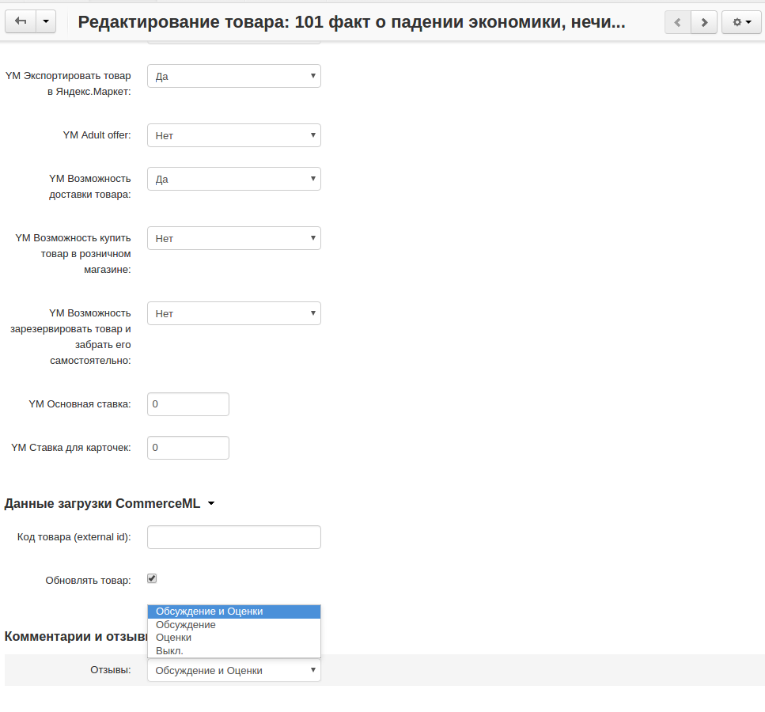
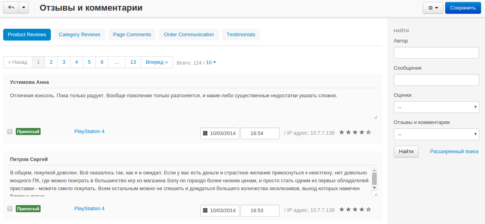

******************************************
Как включить модуль "Комментарии и отзывы"
******************************************

Для того, чтобы дать покупателям возможность оставлять комментарии:

* В панели администратора, откройте **Модули → Управление модулями**.

* Убедитесь в том, что модуль **Комментарии и отзывы** включен.

* Перейдите в **Товары → Товары** или **Товары → Категории** и щёлкните по имени товара или категории, для которой вы хотите открыть комментарии.

* Откройте вкладку **Модули**

.. note ::

        Вы можете открыть комментарии для товаров, категорий, заказов, блога, страниц и отзывов о магазине.

*   In the **Comments and reviews** section in the **Reviews** drop-down menu choose the type of reviews: *Communication and rating*, *Communication* or *Rating*.

* В разделе **Комментарии и отзывы** в меню **Отзывы** выберите тип отзывов: *Обсуждение и оценки*, *Обсуждение* или *Оценки*. 

To view and manage comments:

*   Go to **Website → Comments and reviews**.
*   Open the tab with comments or reviews that you want to read.
*   If necessary, edit comments and click **Save**.

Для просмотра и управления комментариями:

* Откройте **Веб-сайт → Комментарии и отзывы**.

* Откройте вкладку с комментариями и отзывами, которые вы хотите прочесть.

* Если необходимо, отредактируйте комментарии и щёлкните **Сохранить**.

