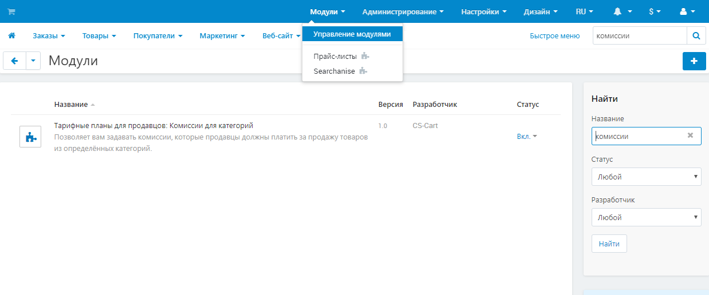

****************************************************
Тарифные планы для продавцов: Комиссии для категорий
****************************************************

.. note::

    Модуль доступен только в Multi-Vendor Plus.

===========
Возможности
===========

Комиссии из модуля :doc:`"Тарифные планы для продавцов" </user_guide/addons/vendor_plans/index>` распространяются на все товары, независимо от их категорий. Если вы хотите установить разную комиссию для разных категорий, используйте модуль **Тарифные планы для продавцов: Комиссии для категорий**.

.. fancybox:: img/category_commission.png
    :alt: У каждого плана могут быть разные комиссии для разных категорий.

Как это работает:

#. По умолчанию в каждой категории стоит та же комиссия, что и в тарифном плане для продавцов.

#. Любая комиссия, которую вы укажете для какой-либо категории, заменит комиссию из :doc:`настроек плана </user_guide/users/vendors/manage_vendor_plans>`, но только для конкретной категории и плана.

   .. important::

       Если вы не установите комиссию для подкатегории, то она унаследует комиссию от своей родительской категории.

#. Комиссия за каждый товар устанавливается его основной категорией. Вы можете найти основную категорию на странице редактирования товара: это первая категория в списке, выделенная жирным шрифтом.

#. Прежде чем рассчитывать комиссию за заказ, Multi-Vendor рассчитывает долю каждого товара в итоговой сумме, на основе которой будет рассчитываться комиссия. Так решаются ситуации, когда стоимость доставки включена в комиссию, или есть скидка, влияющая на общую сумму заказа. 

   Например, у нас есть заказ на товар 1 (100 руб.) и товар 2 (300 руб), но так же есть скидка в размере 300 руб. Промежуточный итог составит 100 руб. Тогда цена товара 1 составляет 25% от исходной суммы, а товара 2 — 75%. Поэтому комиссия для товара 1 будет считаться с 25 рублей, а для товара 2 — с 75 рублей.

   .. note::

       Это не влияет на абсолютные комиссии тарифного плана; они применяются к заказам уже после расчёта комиссий для категорий. 

=========
Установка
=========

Модуль **Тарифные планы для продавцов: комиссии для категорий** устанавливается :doc:`как и любой другой модуль </user_guide/addons/1manage_addons>`. Обратите внимание, что вы сможете установить этот модуль только при наличии Multi-Vendor Plus. В противном случае вам будет предложено обновить вашу лицензию.

