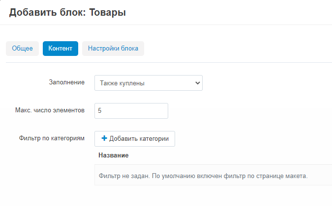
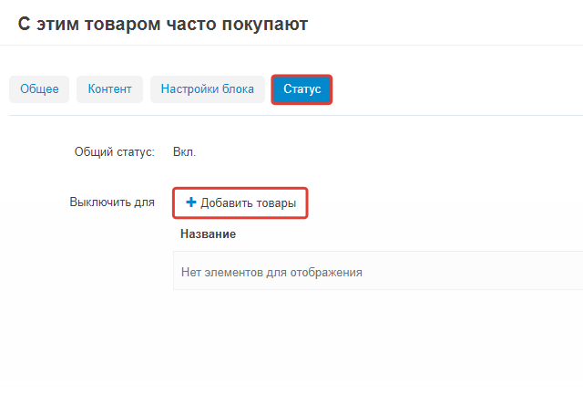

**********************************************************************
Как отобразить товары, которые часто покупают с уже выбранной позицией
**********************************************************************

.. note::

    Убедитесь, что модуль **С этим товаром часто покупают...** установлен и активирован через страницу **Модули → Управление модулями**. 

Чтобы отобразить товары, которые часто покупают с выбранной позицией:

*   В панели администратора выберите страницу **Дизайн → Макеты → Товары**.
*   Выберите секцию, где будут отображаться товары, нажмите на ней на конпку **+** и выберите **Добавить блок**. В открывшемся окне:

    *   Откройте вкладку **Создать новый блок** и выберите **Товары**.
    *   В графе **Название** напечатайте название блока (например, *С этим товаром часто покупают...*).
    *   Откройте вкладку **Контент** и в выпадающем окне выберите *Также куплены*. Выберите **Макс. число элементов** — количество дополнительно предлагаемых товаров, которое отобразится на странице. При необходимости добавьте **Фильтр по категориям**.
    *   Нажмите **Создать**.

Чтобы отключить эту функцию для некоторых товаров:

*   Выберите **Дизайн → Макеты → Товары**.
*   Нажмите на **шестеренку** на созданном блоке (например, *С этим товаром часто покупают...*).
*   Перейдите на вкладку **Статус**, в разделе **Включить для** нажмите на кнопку **Добавить товары** и выберите товары, для которых необходимо отключить функцию отображения товаров, которые покупают вместе с выбранной позицией.
*   Нажмите **Сохранить**.

