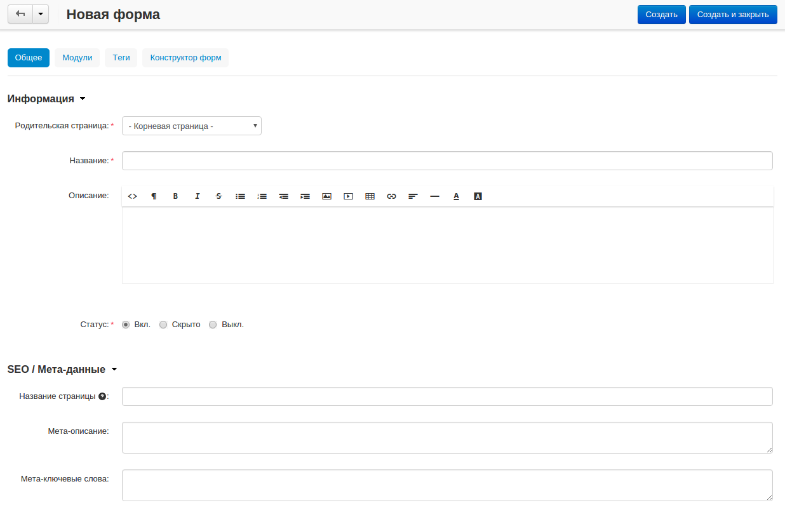
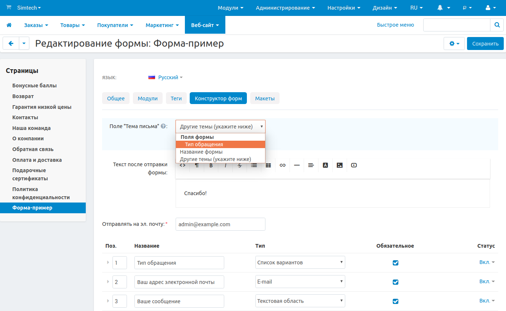

*******************************
Создание пользовательской формы
*******************************

=========================================
Шаг 1. Включите модуль "Конструктор форм"
=========================================

1.1. В панели администратора, откройте раздел **Модули → Управление модулями**.

1.2. Убедитесь в том, что статус модуля **"Конструктор форм"**—**Вкл.**

=====================
Шаг 2. Создайте форму
=====================

2.1. Откройте раздел **Веб-сайт → Страницы**.

2.2. Щёлкните по кнопке **+** и выберите **Добавить форму**.

2.3. Введите параметры формы на вкладке **Общее**:

     * **Родительская страница** — выберите для формы родительскую страницу.

     * **Название** — введите название формы (например, *форма обратной связи*).

     * Если необходимо, заполните остальные поля.

2.4. Настройка вкладки **"Конструктор форм"**.

     * **Поле "тема письма"** — заполненная форма отсылается на указанный почтовый адрес. В данном поле вы можете указать тему данного письма:

       * **Название формы** — темой письма служит само название формы.

       * **Другие темы** — при выборе данной опции под ней появится поле ввода, куда можно ввести свою тему сообщения.

     * **Текст после отправки формы** — введите текст, который будет отображаться после того, как пользователь заполнит форму.

     * **Отправлять на эл. почту** — введите адрес электронной почты, на которую будут приходить уведомления.

     * Добавьте поля в вашу форму. Существует два типа полей: **стандартные** (*список вариантов*, *текстовая область*, *радиогруппа*, и т.д.) и **специальные** (*дата*, *e-mail*, *число*, *телефон*, и т.д.).

.. hint::

   Вы можете позволить пользователям прикреплять файлы к формам, для этого создайте поле и выберите тип **Файл**. 

2.5. Щёлкните **Создать**.

.. image:: img/form_builder_02.png
	:align: center
	:alt: Используйте вкладку **Конструктор форм** для уточнения полей формы и почтового адреса, на который следует отправлять заполненные формы.

======================================================
Шаг 3. Установите поле формы в качестве темы сообщения
======================================================

.. note::

    Это необязательный пункт доступный с версии 4.3.7.

Когда вы редактируете уже созданную форму, вы можете установить одно из существующих полей в качестве **поля "Тема письма"**. Данное поле должно иметь один из следующих типов:

* Поле ввода.

* Список вариантов. 

.. hint::

    Не забывайте нажать **Сохранить** после внесения изменений.

