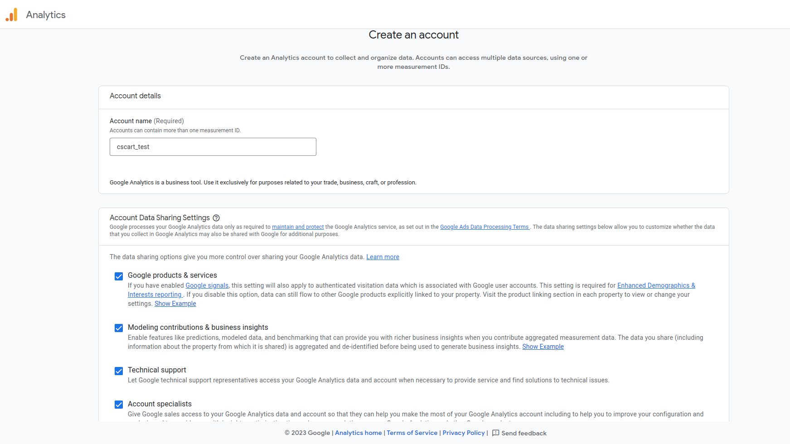
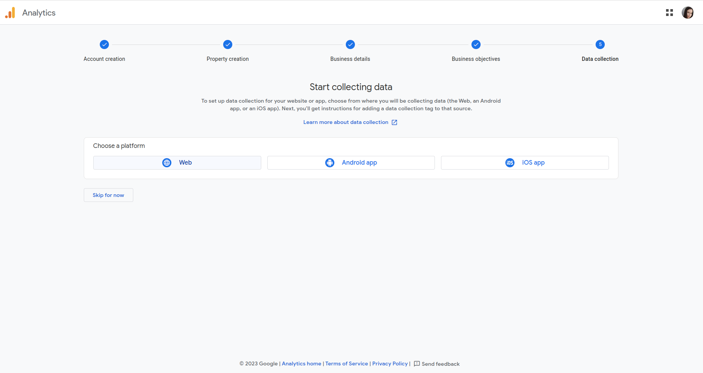
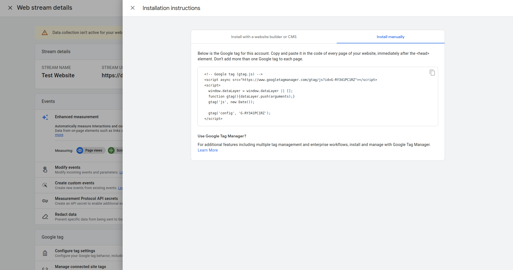
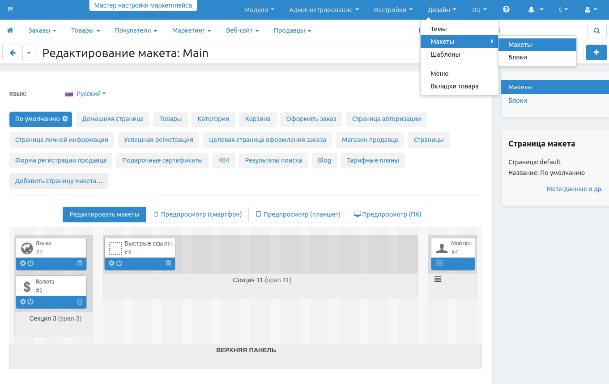

*************************************
Как настроить модуль Google Analytics
*************************************
.. note ::

	Поддержка Google Analytics 4 была добавлена в версии 4.12.2.

Модуль **Google Analytics** позволяет администратору отслеживать статистику CS-Cart в своей учетной записи Google. Этот модуль основан на `Universal Analytics <https://support.google.com/analytics/answer/2790010?hl=en>`_.

.. contents::
   :backlinks: none
   :local:

==============================
Как настроить Google Analytics
==============================

*   Перейдите на страницу **Модули → Скачанные модули** и включите модуль **Google Analytics** (поменяйте статус на *Активный*).
*   Нажмите на название модуля, чтобы открыть настройки.
*   Введите **Номер учетной записи Google Analytics** во вкладке **Настройки**.
*   Нажмите **Сохранить**.

------------------------------------------------------------------
Как создать собственную учетную запись на стороне Google Analytics
------------------------------------------------------------------

Войдите в свою учетную запись Google и перейдите на страницу `Google Analytics <http://www.google.com/analytics>`_. Нажмите на кнопку **Get started today** и следуйте инструкции.

**Шаг 1.** Нужно ввести имя новой учетной записи Google Analytics в поле Account name и отметить галочкой настройки общего доступа к данным учетной записи.

    
**Шаг 2.** Создайте свойство  Google Analytics 4. Каждое свойство, которое вы создаете, содержит все ваши данные измерений для любого набора веб-сайтов и приложений, которые вы выберете.

.. image:: img/step_2.png
    :align: center
    :alt: Step 2

**Шаг 3.** Выберите категорию индустрии, к которой относится ваш бизнес и количество сотрудников. 

.. image:: img/step_3.png
    :align: center
    :alt: Step 3

**Шаг 4.** Выберите наиболее важные для вас цели, чтобы получать отчеты в соответствии с ними.

.. image:: img/step_4.png
    :align: center
    :alt: Step 4

**Шаг 5.** Выберите платформу, для которой будут собираться данные: веб-сайт, Android-приложение или iOS-приложение. Этот шаг можно пропустить, нажав на кнопку **Skip for now**. После этого вам будет предложено ввести данные вашего приложения:

Если вы выбрали веб-сайт - нужно ввести адрес вашего веб-сайта, после чего опубликовать google tag на всех страницах сайта. О том, как это сделать, мы рассказываем ниже. 

Если выбрано Android или iOS-приложение, нужно будет ввести учетные данные проекта в Firebase и пройти по шагам предложенной инструкции установки приложения. 

.. image:: img/step_5_website.png
    :align: center
    :alt: Step 5

---------------------------------------------    
Как добавить Google Tag на все страницы сайта
---------------------------------------------

Рассмотрим на следующем примере. В шаге 5 вы выбрали платформу - веб-сайт и ввели вдрес вашего веб-сайта. Теперь вам нужно разместить Google Tag на всех его страницах, чтобы отслеживать выбранные вами метрики. 

*   В Панели администратора перейдите на страницу **Дизайн - Макеты**. Найдите макет страницы **По умолчанию** и нажмите на шестеренку рядом с названием макета. 

*   Скопируйте Google Tag и вставьте его в поле **Пользовательский HTML код**.

.. image:: img/design_2.png
    :align: center
    :alt: Design

*   Отметьте галочкой поле **Скопировать на остальные страницы**. 
*   Нажмите **Сохранить**.

После этого должно пройти некоторое время, чтобы метрики начали отслеживаться в Google Analytics. 
