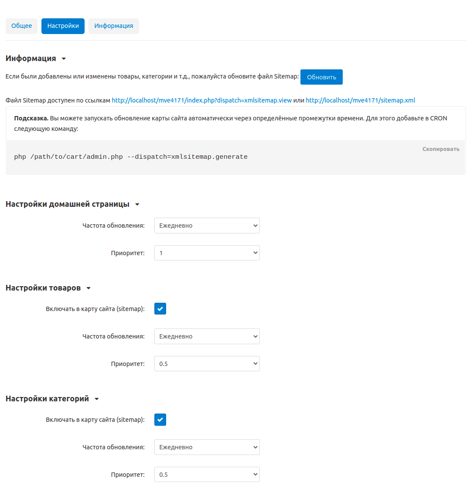

****************************************************
Как настроить модуль Карта сайта для Yandex и Google
****************************************************

Модуль генерирует карту сайта в формате XML, что облегчает индексацию поисковыми системами (Google, Yandex и другими). Карта сайта позволяет веб-сканерам определить местоположение страниц, частоту и время их последнего обновления, чтобы эффективнее индексировать страницы. Это особенно важно для маркетплейсов с большим количеством страниц товаров и категорий. 

#. Откройте в Панели администратора страницу **Модули → Скачанные модули** и удостоверьтесь, что модуль **Карта сайта для Yandex и Google** установлен и активен (в статусе Вкл.).

#. Нажмите на название модуля.

#. Отметьте галочкой те настройки, которые хотели бы включить в карту сайта (кроме **Настройки домашней страницы**, потому что эта настройка включена по умолчанию).

#. В выпадающем списке **Частота обновления** выберите желаемую частоту обновления.

#. В выпадающем списке **Приоритет** выберите нужный приоритет настройки.

   .. note ::

	   Это можно настроить для следующих элементов карты сайта: **Домашняя страница**, **Настройки товаров**, **Настройки категорий**, **Настройки страниц**, **Настройки страниц характеристики с типом бренд/производитель**, **Настройки компаний**. 

#. Нажмите **Сохранить**.

.. note ::

	Если были добавлены или изменены товары, категории и т.д., обновите файл Sitemap, нажав на кнопку **Обновить** в настройках модуля  **Карта сайта для Yandex и Google**, чтобы обновить xml файл карты сайта.

На карту сайта можно перейти по URL-адресу http://www.domain.com/sitemap.xml, если включен модуль :doc:`/user_guide/addons/seo/index`. Если он отключен, вам нужно добавить следующий код в файл *.htaccess*, чтобы этот URL-адрес заработал:

``RewriteRule ^sitemap\.xml$ ./index.php?dispatch=xmlsitemap.view [L]``. 

Добавьте эту строку после ``# RewriteBase /``.
