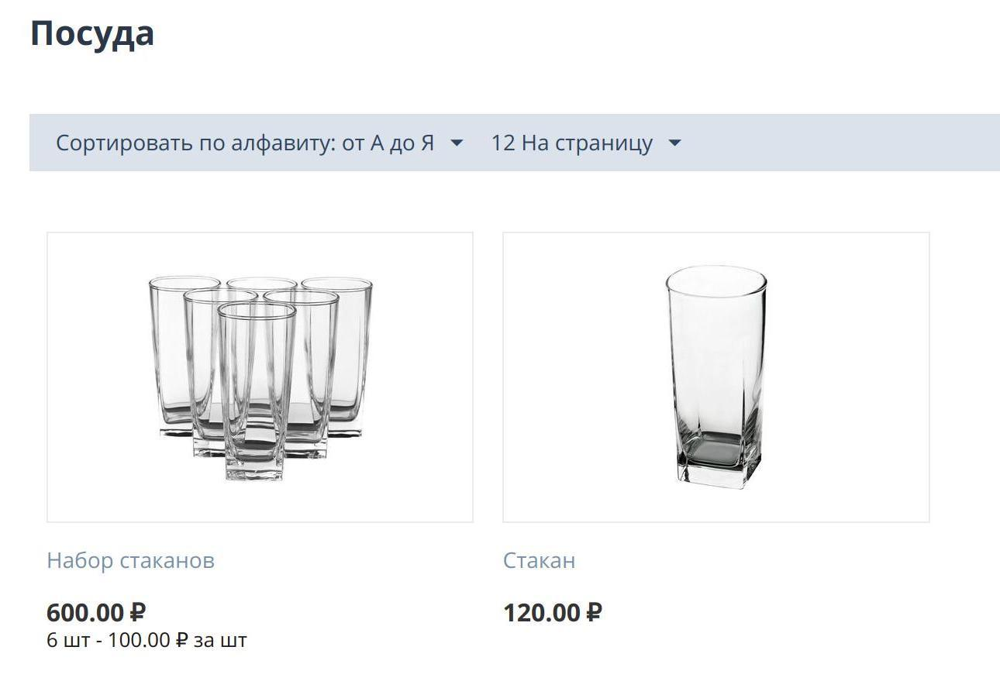
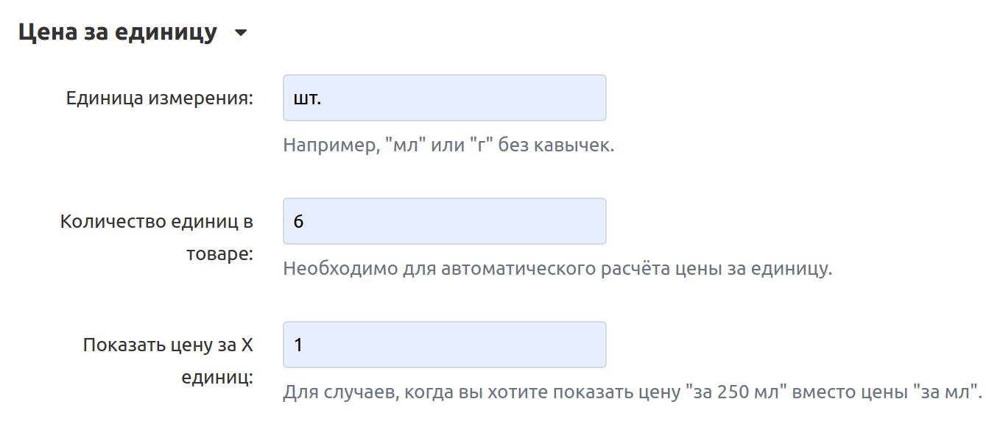

*****************
"Цена за единицу"
*****************

В CS-Cart и Multi-Vendor 4.15.1 мы добавили модуль, который позволяет указывать цену за единицу товара (литр, миллилитр, килограмм и т. д.)

Если в вашем магазине выставлены на продажу несколько товаров в упаковке или коробке, то такую группу товаров выгодно продавать со скидкой. Когда покупатель видит, сколько можно сэкономить, приобретая сразу несколько товаров в одной коробке, ему легче принять решение о покупке. С помощью модуля “Цена за единицу” можно указать на витрине цену за единицу и за группу товаров.

================
Функциональность
================

:doc:`После установки модуля </user_guide/addons/1manage_addons>` в панели администратора на странице редактирования товара добавляется раздел «Цена за единицу». Там вы указываете желаемую единицу измерения, например «мл», «г» или «шт», и количество единиц в товаре. Также укажите количество единиц, для которых будет отображаться цена, если вам нужно, чтобы цена была «за 1 шт» или «за 250 мл» вместо «за мл».

Например, продается коробка с шестью стаканами. На витрине, на списке товаров и на странице с самим товаром, цена за один стакан появится автоматически. Для этого в настройках нужно указать единицу измерения «шт» и количество единиц в товаре «6».

:doc:`Экспортируйте и импортируйте </user_guide/import_export/about_import_and_export>` поля товара из раздела «Цена за единицу» вместе с остальными полями.

