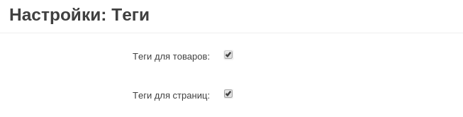
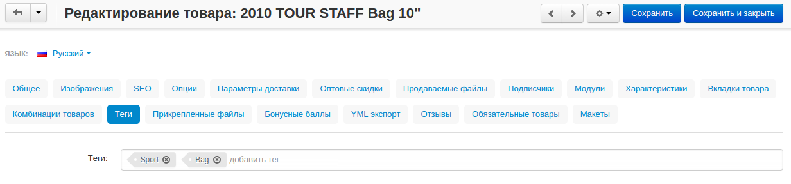
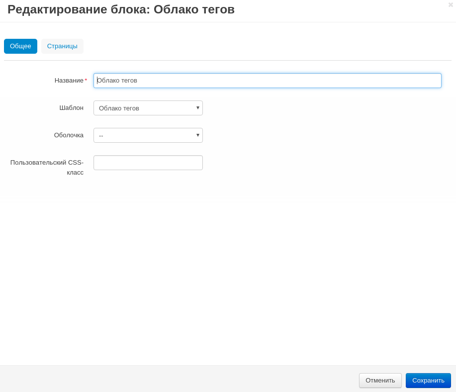

*************************
Как добавить облако тегов
*************************

==============================
Шаг 1. Настроить модуль "Теги"
==============================

1.1. Перейдите на страницу **Модули → Управление модулями** в панели администратора.

1.2. Убедитесь, что у модуля **Теги** стоит статус *Вкл.*

1.3. Нажмите на название модуля. Откроется окно, где нужно задать настройки:

     * **Теги для товаров** – включите настройку, чтобы появилась возможность задавать теги товарам.

     * **Теги для страниц** – включите настройку, чтобы появилась возможность задавать теги страницам.

1.4. Нажмите кнопку **Сохранить**.

==========================
Шаг 2. Задать теги товарам
==========================

2.1. Перейдите на страницу **Товары → Товары** в панели администратора.

2.2. Нажмите на название товара, которому хотите добавить тег.
 
2.3. Перейдите на вкладку **"Теги"**. В поле **Теги** по очереди впишите желаемые теги. Отделять из друг от друга можно запятыми или нажатием клавиш **Enter** или **Tab**.

2.4. Нажмите **Сохранить и закрыть**.

=======================================
Шаг 3. Добавить облако тегов на витрину
=======================================

3.1. Перейдите на страницу **Дизайн → Макеты** в панели администратора.

3.2. Выберите макет страницы, где вы хотите разместить облако тегов. Например, макет *Homepage* (*Домашняя страница*).

3.3. Нажмите кнопку **+** у секции, где вы хотите разместить облако тегов. Выберите **Добавить блок**.

3.4. В открывшемся окне перейдите на вкладку **Создать новый блок** и выберите блок **Теги**.

3.5. Укажите имя блока (например, *Блок с тегами*) и шаблон (*Облако тегов*). Нажмите кнопку *Создать*.

3.6. (опционально) Нажмите на иконку с изображением шестеренки у нового блока. Теперь можно задать настройки **Оболочка** и **Пользовательский CSS-класс**, если необходимо. Нажмите **Сохранить**.

В новом блоке появятся все теги, созданные администраторами.

.. note ::

    После того, как создадите блок, проверьте, правильно ли он отображается. Некоторые варианты настройки **Оболочка** могут не подходить для блока.
