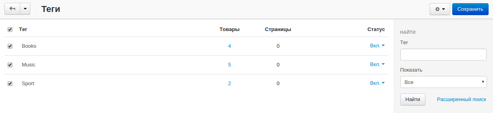

********************
Как управлять тегами
********************

.. important::

    Сначала убедитесь, что в разделе **Модули → Управление модулями** включен модуль **"Теги"**.

Теги — это любые ключевые слова или метки, которые помогают найти товар или страницу. Управлять существующими тегами можно через панель администратора на странице **Веб-сайт → Теги**.

Теги появляются в **облаке тегов**, которое можно добавить через страницу **Дизайн → Макеты**. Есть отдельная инструкция о том, :doc:`как добавить облако тегов <tag_cloud>`.

Удалить тег можно, нажав на кнопку с изображением шестеренки и выбрав пункт **Удалить**. Кнопка появляется, если навести курсор мыши на тег. Для массового редактирования отметьте нужные теги флажками и используйте кнопку с изображением шестеренки в правом верхнем углу экрана.

.. note:: 

    Если у вас несколько магазинов с общей панелью администратора, теги для каждого магазина создаются и редактируются отдельно.

====================================
Что означают столбцы в таблице тегов
====================================

* **Тег** — имя тега.

* **Товары** — количество товаров, которым назначен этот тег.

* **Страницы** — количество страниц, которым назначен этот тег.

.. hint::

    Если нажать на количество товаров или страниц, откроется список товаров или страниц с данным тегом.

.. important::

    Столбцы **Товары** и **Страницы** появятся только если на странице **Модули → Управление модулями** в настройках модуля **"Теги"** включены настройки **Теги для товаров** и **Теги для страниц**. 

* **Статус** — позволяет выключить какой-либо тег, не удаляя его. 
