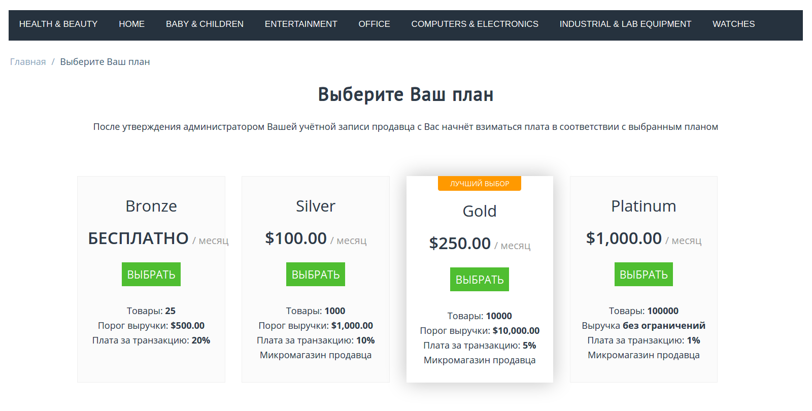

****************************
Тарифные планы для продавцов
****************************

.. note::

    Эта статья применима только к **Multi-Vendor**.

Модуль **Тарифные планы для продавцов** позволяет вам предлагать тарифные планы для поставщиков. Эти планы могут иметь ограничения по количеству продуктов, доходам, разрешенным категориям и т. д. В зависимости от того, как вы сконфигурируете надстройку, поставщики смогут или не могут самостоятельно переключаться на другие планы.

Начиная с Multi-Vendor 4.4.1, этот модуль заменил модуль **Комиссия продавца**. 

.. important::

    Если вы планируете обновление до Multi-Vendor 4.4.1, убедительная просьба сперва прочитать про :doc:`переход с Комиссии продавцов до Тарифных планов для продавцов. <../vendor_commission/vendor_commissions_and_plans>`

* :doc:`vendor_plans_settings`

* :doc:`../../users/vendors/manage_vendor_plans`

* :doc:`../../users/vendors/allow_customers_to_apply_for_vendor_account`

.. toctree::
    :maxdepth: 2
    :titlesonly:
    :hidden:
    
    vendor_plans_settings
