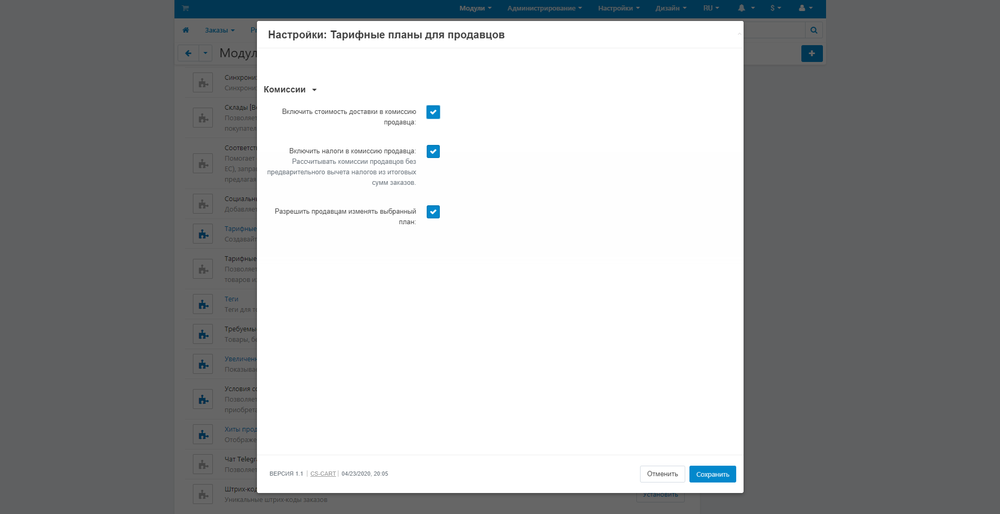

***********************************************
Настройка модуля "Тарифные планы для продавцов"
***********************************************

.. note::

    Эта статья применима только к **Multi-Vendor 4.4.1** и новее. Модуль **Тарифные планы для продавцов** установлен по умолчанию.

1. В панели администратора Перейдите к **Модули → Управление модулями**.

2. Найдите модуль **Тарифные планы для продавцов** и нажмите на его название.

3. Настройки модуля:

   * **Включить стоимость доставки в комиссию продавца**—если поставить галочку, то доставка будет осуществляться за счёт продавцов.
  
   * **Включить налоги в комиссию продавца**—если поставить галочку, то клиент не увидит платежной надбавки, а платежные надбавки не будут применяться к общей сумме заказа.

   * **Разрешить продавцам изменять выбранный план**— если поставить галочку, то продавцы :ref:`смогут самостоятельно перейти на другой тариф. <switch-between-vendor-plans>` Иначе продавцы не увидят других тарифов при изменении своего профиля.

.. important::

    Те кто :doc:`хотят стать продавцами <../../users/vendors/allow_customers_to_apply_for_vendor_account>` смогут видеть все активные планы тарифов вашего магазина.

4. Нажмите **Сохранить** чтобы применить изменения.

