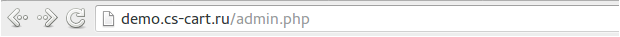
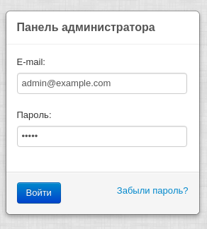
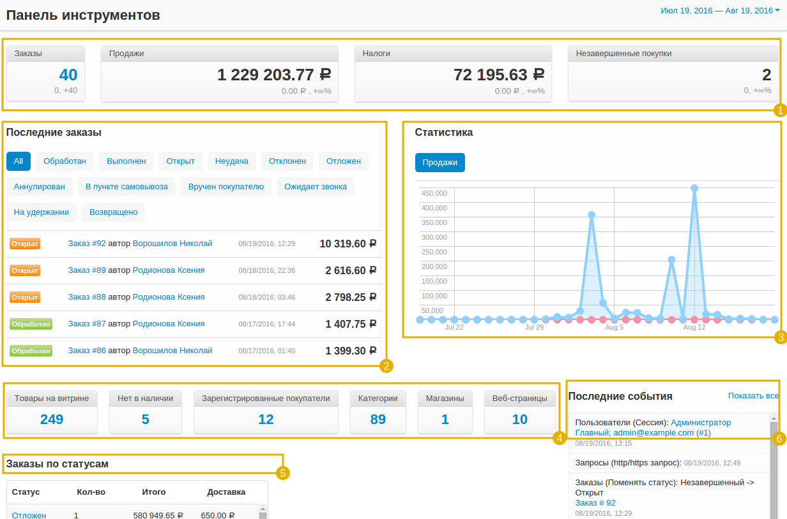
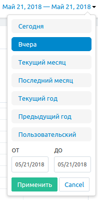
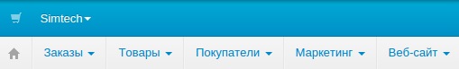

***********************
О панели администратора
***********************

.. note::

    **Сложность инструкции: 1 / 3**

**Панель администратора** — это ваш основной инструмент при работе с магазином. В ней вы можете управлять товарами, обрабатывать заказы, задавать скидки, общаться с покупателями, менять дизайн магазина и многое другое.

===================================
Подключение к панели администратора
===================================

Чтобы попасть в панель администратора, с помощью браузера откройте сайт вашего магазина и добавьте */admin.php* в конец адресной строки.

.. important::

    Если вы уже :doc:`установили CS-Cart <../install/index>` и :doc:`переименовали admin.php <../install/security>` из соображений безопасности, добавьте к адресу вашего магазина **новое имя, используемое вместо admin.php**, например:

    *mynewshop.tk/my_admin_panel.php* 

Например, чтобы войти в панель администратора онлайн демо-магазина CS-Cart (`demo.cs-cart.ru <http://demo.cs-cart.ru/>`_), перейдите к: `demo.cs-cart.ru/admin.php <http://demo.cs-cart.ru/admin.php>`_

Введите **e-mail** администратора и **пароль**, которые вы использовали во время установки CS-Cart. В онлайн демо-магазине CS-Cart e-mail и пароль уже введены, поэтому всё что требуется - это щёлкнуть по кнопке **Войти**. 

===================
Панель инструментов
===================

Первое, что вы заметите, войдя в панель администратора, это **Панель инструментов**, где вы можете просмотреть статистику продаж, недавние заказа и изменения товаров. Также на панели инструментов показаны данные из базы данных, например, количество товаров на витрине и число зарегистрированных покупателей.

1. Общее количество заказов, продаж, налогов и незавершённых покупок в вашем магазине.

2. Последние заказы, произведённые в магазине. При переключении вкладок отображаются заказы с определённым статусом.

3. Ежемесячная статистика магазина, представленная в виде диаграммы.

4. Краткая статистика магазина: количество товаров, покупателей, страниц, и т.д. Щёлкните по числу, чтобы перейти на страницу с подробной информацией о разделе.

5. Количество заказов с определённым статусом и общая выручка, полученная с заказов данного типа.

6. Краткий вариант информации, представленной в секции **Администрирование → Журнал событий**. Щёлкнув кнопку **Показать всё**, вы попадете на страницу журнала событий.

Также вы можете регулировать период времени, информация по которому отображена на панели инструментов. Щёлкните по периоду в правом верхнем углу страницы и выберите необходимый период времени из выпадающего меню. Также, существует возможность задать **пользовательский период**: кликните кнопку **Пользовательский**, задайте период и нажмите кнопку **Применить**.

==============
Верхняя панель
==============

Давайте взглянем на верхнюю панель:

* **Модули** — управление расширениями, добавляющими новый функционал в магазин.
* **Администрирование** — создание резервных копий магазина, импорт и экспорт данных, обновление магазина, редактирование витрин, способы оплаты и достаки, налоги и валюты.
* **Настройки** — настройка различных аспектов магазина, таких как единицы измерения массы, карта сайта, язык панели администратора по умолчанию и настройки почты.
* **Дизайн** — редактирование меню магазина, изменения внешнего вида и структуры отдельных видов страниц.

Кроме того, верхняя панель позволяет выбрать язык панели администратора и валюту, которая будет использоваться на панели инструментов и в отчётах продаж.

**Иконка корзины** на левой стороне верхней панели позволяет перейти к витрине. **Витрина** — это то место, куда попадают покупатели, когда открывают ваш магазин.

Вы можете управлять несколькими витринами из одной панели администратора. Щёлкните по названию магазина рядом с иконкой корзины и выберите витрину, или нажмите **Управление магазинами...** для редактирования и добавления новых.

.. note::

    Для того, чтобы управлять витринами из одной панели администратора, вам потребуется `приобрести лицензии на дополнительные витрины <https://www.cs-cart.ru/dopolnitelnaya-vitrina.html>`_. Исключением являются пользователи CS-Cart версии Ultimate.

===================
Операции в магазине
===================

Для проведения различных операций в магазине используется серая панель, расположенная под верхней панелью:

* **Иконка домашней страницы** возвращает пользователя на страницу панели инструментов.

* **Заказы** — позволяет просматривать отчёты продаж, обрабатывать заказы и оформлять отгрузки.

* **Товары** — редактирование товаров, их категорий, характеристик, фильтров и опций.

* **Покупатели** — управление аккаунтами администраторов и зарегистрированных покупателей, а также группами пользователей с различными привилегиями.

* **Маркетинг** — продвижение товаров, бонусные предложения, просмотр незавершённых покупок.

* **Веб-сайт** — создание и публикация страниц, опросов, форм и ссылок, а также управление `SEO <https://en.wikipedia.org/wiki/Search_engine_optimization>`_-аспектами магазина.

.. note::

    Ваша панель администратора может иметь дополнительные подсекции меню, в зависимости от модулей, которые были установлены и включены.

