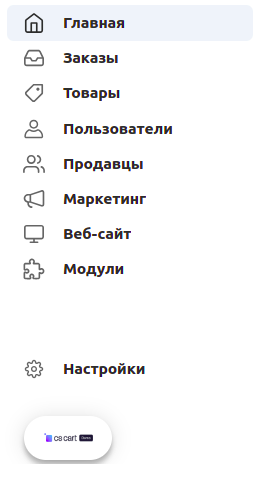
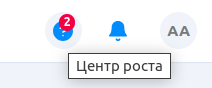

***********************
О панели администратора
***********************

**Панель администратора** — это ваш основной инструмент при работе с магазином. В ней вы можете управлять товарами, обрабатывать заказы, задавать скидки, общаться с покупателями, менять дизайн магазина и многое другое.

===================================
Подключение к панели администратора
===================================

Чтобы попасть в панель администратора, с помощью браузера откройте сайт вашего магазина и добавьте */admin.php* в конец адресной строки.

.. important::

    Если вы уже :doc:`установили CS-Cart <../install/index>` и :doc:`переименовали admin.php <../install/security>` из соображений безопасности, добавьте к адресу вашего магазина **новое имя, используемое вместо admin.php**, например:

    *mynewshop.tk/my_admin_panel.php* 

Например, чтобы войти в панель администратора онлайн демо-магазина CS-Cart (`demo.cs-cart.ru <http://demo.cs-cart.ru/>`_), перейдите к: `demo.cs-cart.ru/admin.php <http://demo.cs-cart.ru/admin.php>`_

.. fancybox:: img/intro/url.png
    :alt: Адрес панели администратора в онлайн демо-магазине CS-Cart.

Введите *e-mail* администратора и *пароль*, которые вы использовали во время установки CS-Cart. В онлайн демо-магазине CS-Cart e-mail и пароль уже введены, поэтому всё что требуется — это щёлкнуть по кнопке **Войти**. 

.. fancybox:: img/intro/login.png
    :alt: Форма входа в панель администратора CS-Cart.

===================
Панель инструментов
===================

Первое, что вы заметите, войдя в панель администратора, это **Панель инструментов**, где вы можете просмотреть статистику продаж, недавние заказы и изменения товаров. Также на панели инструментов показаны данные из базы данных, например, количество товаров на витрине и число зарегистрированных покупателей.

.. fancybox:: img/intro/dashboard2.png
    :alt: На панели инструментов отображается статистика вашего магазина.

#. Ежемесячная статистика магазина с общей выручкой, представленная в виде диаграммы. Нажмите **См.отчеты**, чтобы посмотреть отчеты о продажах.

#. Количество активных товаров на витрине. Нажмите **См.товары**, чтобы перейти на страницу с подробной информацией о разделе.

#. Количество заказов в магазине за выбранный период (по умолчанию - месяц). Нажмите **См.заказы**, чтобы перейти на страницу с заказами.

#. Последние заказы, произведённые в магазине. При переключении вкладок отображаются заказы с определённым статусом.

#. Краткая статистика активности продавцов: по клику на каждую из ссылок вы откроете соответствующие страницы с подробной информацией, например, можно посмотреть новых продавцов или их новые товары.

#. Количество продавцов и зарегистрированных покупателей в магазине. 

#. Краткий вариант информации, представленной в секции **Настройки → Журнал событий**. Щёлкнув кнопку **См. всё**, вы попадете на страницу журнала событий.

Также вы можете регулировать период времени, информация по которому отображена на панели инструментов. Щёлкните по периоду в правом верхнем углу страницы и выберите необходимый период времени из выпадающего меню. Также существует возможность задать *пользовательский период*: кликните кнопку **Пользовательский**, задайте период и нажмите кнопку **Применить**.

.. fancybox:: img/intro/periods2.png
    :alt: Просмотр статистики за определённый период. 

==============
Боковая панель
==============

Давайте взглянем на боковую панель:

* **Главная** — переносит пользователя на главную страницу панели администратора.

* **Заказы** —  позволяет просматривать заказы, отчеты о продажах, отгрузки, незавершенные покупки и проверить заявки на обратный звонок. 

* **Товары** —  позволяет просматривать товары, категории, характеристики, фильтры и опции, а также управлять отзывами на товары. 

* **Пользователи** —  в этом разделе можно создавать и удалять учетные записи покупателей и администраторов, регулировать привилегии групп пользователей и просматривать сообщения от пользователей в *Центре сообщений*.

* **Продавцы** — (доступно только в CS-Cart для маркетплейсов) позволяет управлять продавцами и их администраторами, тарифными планами продавцов, а также вести бухгалтерский учет. 

* **Маркетинг** — в этом разделе можно настроить всё, что нужно для продвижения товаров: промо-акции и скидки, комплекты товаров, подарочные сертификаты и бонусные баллы, баннеры и прайс-листы. 

* **Веб-сайт** — этот раздел позволяет управлять внешним видом магазина. Можно настроить тему сайта, создать блог и посты для него, управлять меню сайта, настроить теги и `SEO <https://en.wikipedia.org/wiki/Search_engine_optimization>`_, создать карту сайта и просмотреть комментарии. 

* **Модули** — управление расширениями, добавляющими новую функциональность в магазин. 
    * В разделе *Скачанные модули* отображаются все доступные к скачиванию и установке модули CS-Cart. 
    * В разделе *Обновления* их можно обновить, а в разделе *Разработчики* — посмотреть модули, отсортированные по разработчикам. 
    * *Маркет модулей* переносит на страницу, где вы можете приобрести модули от наших партнеров, разработанные для CS-Cart.

* **Настройки** — это большой раздел, в котором есть всё для тонкой настройки магазина или маркетплейса:
    * В *Общих настройках* хранится информация о компании. 
    * *Учетная запись, Поля профиля* и *Уведомления* переносят пользователя на соответствующие страницы и позволяют управлять учетной записью и лицензией, полями профиля пользователей и уведомлениями.
    * *Импорт данных* и *Экспорт данных* позволят импортировать или экспортировать товары, заказы, пользователей и многое другое. 
    * В *Хранилище данных* можно создать резервную копию магазина, а в *Центре обновлений* - получить последние версии CS-Cart и модулей и обновить их. 
    * В *Способах оплаты* можно настроить варианты оплаты, которые будут доступны покупателям, а в *Налогах* настроить какие налоги показывать и как их считать.
    * В *способах доставки* настройте варианты доставки товаров, их стоимость и доступность в зависимости от региона, а в *Магазины и ПВЗ* - создайте и настройте пункты самовывоза.
    * *Витрины* позволяют настраивать существующие или создавать новые витрины, а также управлять мультивитринностью.
    * *Тексты и языки* позволяют редактировать любой текст на сайте и выбрать доступные языки.
    
    .. image:: img/intro/admin_settings.png
        :align: center
        :alt: Настройки панели администратора.
    
===========
Центр роста
===========

**Центр роста**, кнопка которого расположена в правом верхнем углу панели администратора — это способ быстро познакомиться с CS-Cart. Этот инструмент будет полезен новичкам, так как поможет найти всю информацию, нужную для быстрого старта продаж в магазине или маркетплейсе. Если открыть **Центр роста** на странице магазина, например, *Товары*, то вам будут показаны соответствующие материалы — статьи о действиях с товарами, видео, модули и другие полезные ресурсы.

Актуальная информация
=====================

В этом разделе есть следующие секции: **Документация, Видео, Модули и темы**.

* В секции **Документация** расположены ссылки на все необходимые для знакомства и первоначальной настройки CS-Cart материалы. Содержание этой секции зависит от того ,на какой странице вы её откроете: например, если открыть Центр роста на странице *Товары* и перейти в раздел Документация, то вам будут представлены ссылки на статьи из документации, относящиеся к товарам в CS-Cart. 

 .. image:: img/intro/growth_center_docs.png
    :align: center
    :alt: Раздел Центра роста с документацией на странице Товары.

* В секции **Видео** располагаются короткие видеоинструкции по настройке той или иной функциональности магазина. Содержание зависит от того, на какой страницы вы откроете этот раздел. 
* В секции **Модули и темы** вам будут предложены актуальные модули в зависимости от страницы, на которой вы откроете **Центр роста**. Темы предлагаются на *Главной странице* панели администратора. 

Помощь
======

Этот раздел содержит две секции: **Быстрый запуск** и **Задать вопрос**.

* **Быстрый запуск** представляет несколько полезных обзорных видео о быстром старте с CS-Cart для новичков.
* Секция **Задать вопрос** позволит просмотреть свои последние тикеты в Help desk или обратиться к команде поддержки CS-Cart.

Ресурсы
=======

Этот раздел состоит из трех частей: **Что нового**, **Сообщество** и **Блог**. 

* **Что нового** — на этой странице собраны обзорные статьи на последние нововведения в функциональность CS-Cart.
* **Сообщество** — по клику переносит вас на форум CS-Cart.
* **Блог** — по клику переносит вас в блог CS-Cart.
