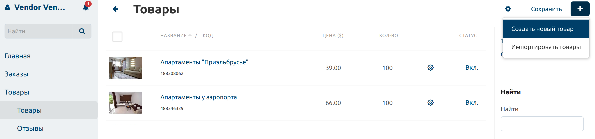
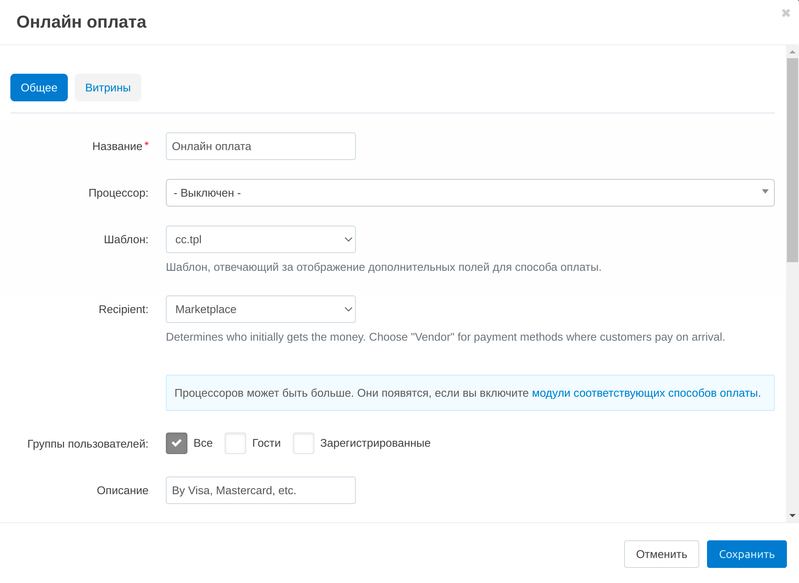

************
Бронирование
************

**CS-Cart Multi-Vendor Бронирование** позволяет создать бизнес по бронированию жилья онлайн. Вот как он может выглядеть:

* Владельцы недвижимости (продавцы) регистрируются на вашем сайте и создают товары — свои предложения по аренде жилья.

* Клиенты на сайте указывают место и дату размещения, выбирают подходящее предложение и бронируют его.

* Вы, как администратор, одобряете или не одобряете владельцев собственности, решаете, что они могут или не могут делать, определяете, как клиенты будут оплачивать жильё — онлайн через маркетплейс или при встрече с владельцем, общаетесь с вашими продавцами и клиентами и многое другое.

Рассмотрим реализацию таких сценариев с технической стороны.

.. contents::
   :backlinks: none
   :local:

==============================================
Как владельцы недвижимости создают предложения
==============================================

Чтобы сдать жильё в аренду, перейдите на страницу **Товары → Товары** и нажмите кнопку **+** в правом верхнем углу. Откроется страница с основными свойствами объекта недвижимости.

Здесь продавец придумывает название для своего предложения, выбирает его месторасположение на карте (:doc:`активируйте Google Карты с помощью модуля "Местоположение продавцов" </user_guide/addons/vendor_locations/configure>`), задаёт **цену** съёма за сутки, загружает :doc:`изображения </user_guide/look_and_feel/logos_banners_images/images_for_store>` и добавляет **подробное описание**.

Если продавец владеет несколькими похожими объектами жилья (например, комнаты в отеле или дома), тогда поле "**В наличии**" будет определять, сколько объектов жилья данного типа может предложить продавец. Также здесь продавцы определяют, какие :doc:`налоги </user_guide/shipping_and_taxes/taxes/index>` будут применены к товару.

После нажатия кнопки **Создать**, товар :doc:`отправляется на модерацию </user_guide/addons/vendor_data_premoderation/index>` владельцу маркетплейса и затем может появиться на витрине. Одновременно с этим на странице редактирования товара появляются дополнительные вкладки со свойствами. :doc:`Большая часть из них описана в другой статье </user_guide/manage_products/products/product_attributes>`, а здесь мы рассмотрим только самые важные.

Календарь на вкладке *Брони* позволяет продавцам выяснить:

* какие даты доступны/не доступны для бронирования,

* на какие даты жилье забронировано.

Здесь продавец также задаёт диапазон дат, недоступных для бронирования .

:doc:`Опции </user_guide//manage_products/options/index>` позволяют предлагать клиентам дополнительные услуги, такие как завтраки или обеды.

:doc:`Характеристики </user_guide/manage_products/features/index>` позволяют предлагать арендаторам встроенные удобства, такие как телевидение, Wi-Fi, парковка, возможность размещения с домашними животными и т.д. Наличие таких характеристик помогает найти более подходящее жилье. Вы, как владелец торговой площадки, создаете характеристики, а продавцы выбирают из них те, которые можно применить к их предложениям.

.. _booking-faq-variations:

:doc:`Вариации </user_guide/manage_products/products/product_variations>` позволяют продавцам создавать разные варианты одних и тех же помещений. Например, это может быть стандратный гостиничный номер и его варианты — комнаты класса «Комфорт» и «Люкс».

Вкладка :doc:`Отзывы </user_guide/addons/comments_and_reviews/index>` помогает продавцам взаимодействовать с их клиентами. Здесь они могут читать и редактировать пользовательские отзывы и отвечать комментаторам.

.. image:: img/after_saving.png
    :align: center
    :alt: Product page after saving.

На странице товара может быть больше вкладок и свойств. Их наличие зависит, например от следующих факторов:

* Владельцы маркетплейса управляют настройками на странице товара, используя модуль `"Конфигуратор панели продавцов" <https://youtu.be/kNuEMb6PE2A>`_.

* Некоторые поля появляются в зависимости от того, какие настройки администратор выставил на странице :doc:`Настройки </user_guide/settings/index>`. 

* Вкладки товара могут быть частью модулей и появляться, когда включается модуль в панели администратора. Это относится, например, к вкладке *Вариации*, которая является частью функциональности модуля :doc:`/user_guide/addons/product_variations/index`. 

===========================
Как клиенты бронируют жильё
===========================

#. Клиент приходит на ваш сайт в поисках недвижимости для аренды. Основными параметрами для поиска являются местонахождение объекта и даты заезда-отъезда.

   .. note:: 

       Вы можете указать, насколько заранее клиент может бронировать недвижимость, и максимальную продолжительность бронирования на странице **Настройки → Оформление заказа**.

   .. image:: img/location_date.png
       :align: center
       :alt: Клиент ищет подходящее жилье по месторасположению объекта и датам заезда-отъезда.

#. Клиенту выдаётся список объектов в соответствии с выбранными географическим расположением и датами. Теперь можно отфильтровать предложения по цене и характеристикам, таким как тип объекта (квартира, гостиница, гостевой дом и т. д.) или наличие удобств (например, парковки или телевизора).

   .. note:: 

       Обычно вы, как администратор маркетплейса, :doc:`создаете такие характеристики </user_guide/manage_products/features/product_features>` заранее, а продавцы применяют их к своим товарам. Но вы можете :doc:`разрешить продавцам создавать свои собственные характеристики </user_guide/manage_products/features/vendor_features>`, если это необходимо.

   .. image:: img/filters.png
       :align: center
       :alt: Продавец ищет подходящее жилье с помощью фильтров.

#. На детальной странице объекта жилья клиент может:

   * прочитать отзывы предыдущих жильцов;

   * связаться с маркетплейсом или владельцем недвижимости для уточнения вопросов;

   * выбрать дополнительные услуги, такие как завтрак и обед (администраторы создают их через :doc:`options </user_guide/manage_products/options/index>`).

   .. image:: img/offer_page.png
       :align: center
       :alt: Клиент на детальной странице товара.

#. После того, как клиент нажмает кнопку **Забронировать**, открывается страница оформления заказа. Там он заполняет основную информацию о себе и выбирает способ оплаты. По умолчанию можно выбрать оплату либо по прибытии, либо онлайн (заранее).

   * Если клиент решает платить онлайн, то деньги сначала поступят маркетплейсу. Далее определяется денежное вознаграждения продавца, которое вам необходимо выплатить. 

   * Если клиент решает платить по прибытии, то он передаст деньги непосредственно владельцу жилья. В этом случае продавец должен заплатить маркетплейсу установленный процент.

   После выбора способа оплаты клиент оформляет заказ. Теперь администратор и владелец недвижимости могут просмотреть этот заказ на странице **Заказы → Все заказы**.

   .. image:: img/checkout.png
       :align: center
       :alt: Клиент завершает бронирование.

===========================
Как управлять бронированием
===========================

На странице **Заказы → Бронирования** показан список предложений, имеющихся на маркетплейсе. Продавцы видят на этой странице все объекты, которыми они владеют.

На этой странице вы можете:

* Найти информацию о :ref:`всех вариантах <booking-faq-variations>` объектов, существующих на макретплейсе, и просмотреть их доступность на определенные даты.

* Проверить, какие объекты жилья доступны в выбранные даты, указав данные через встроенный календарь.

* Если объект доступен, то вы можете легко забронировать жильё на нужные даты, нажав кнопку **Забронировать**. Например, это удобно, когда клиент запросил бронирование по телефону.

* Если товара не доступен, то вы можете просто просмотреть все бронирования на выбранные даты, перейдя по ссылке под статусом доступности.

  .. image:: img/bookings.png
      :align: center
      :alt: Страница Заказы → Бронирования.

=======================================================
Как позволить клиентам платить заранее и по прибытии
=======================================================

CS-Cart Multi-Vendor позволяет :doc:`распределять деньги между продавцами и маркетплейсом разными способами </user_guide/users/vendors/workflow>`. CS-Cart Multi-Vendor Booking использует разные схемы распределения денег, в зависимости от того, как клиенты оплачивают бронирование:

* Когда клиент решает платить за объект онлайн (заранее), деньги в первую очередь переходят владельцу маркетплейса. После успешного бронирования встроенные инструменты подсчитывают необходимую часть выручки продавца и передают деньги ему.

* Когда клиент решает платить по прибытии, деньги сначала перейдут продавцу. Продавец должен сам перевести маркетплейсу процент от этой оплаты.

Чтобы клиенты могли оплачивать проживание при создании брони, владелец маркетплейса создает способы оплаты на странице **Администрирование → Способы оплаты**. Продавцы не могут создавать свои способы оплаты.

Чтобы создать способ оплаты, перейдите на указанную выше страницу в панели администратора и нажмите кнопку **+** в правом верхнем углу страницы. Появится страница с :doc:`полями для заполнения </user_guide/payment_methods/configure_payment>`, большая часть которых интуитивно понятна. Основные из них:

**Получатель** — сторона, которая получает деньги изначально.

* Выберите *Продавца* в качестве получателя для способов оплаты "По прибытии". Это будет означать, что сначала продавец получит деньги, а затем будет должен передать маркетплейсу его долю. :doc:`В CS-Cart есть механизмы для передачи выплат от продавцов администратору </user_guide/addons/vendor_debt_payout/index>`.

* Выберите *Маркетплейс* в качестве получателя для способов оплаты "Заранее", тогда деньги постурпят маркетплейсу. Когда в поле **Получатель** стоит значение *Маркетплейс*, появляются дополнительные поля. Одно из них:

**Процессор** — платежная система, которая будет обрабатывать платежи, совершенные с помощью этого :doc:`способа оплаты </user_guide/payment_methods/index>`.

:doc:`Как владельцы недвижимости становятся продавцами </user_guide/users/vendors/allow_customers_to_apply_for_vendor_account>`

.. meta::
   :description::description: FAQ о бронировании для маркетплейсов на Multi-Vendor: функциональность, настройка.
