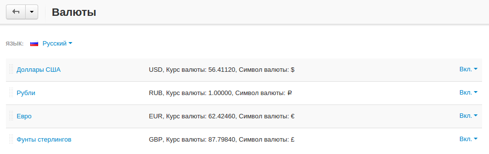
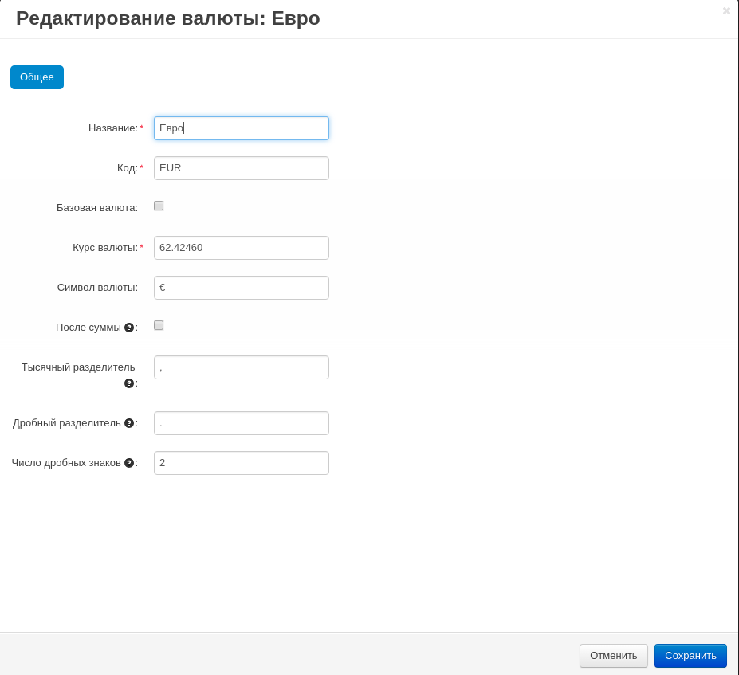
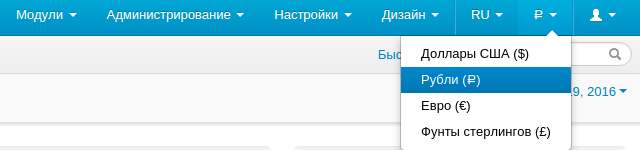

******
Валюты
******

Вы можете редактировать валюты на странице **Администрирование → Валюты**.

Как правило, различные валюты используются для отображения цены на витрине. В основном, платежи принимаются только в базовой валюте магазина.

Однако, если ваша система оплаты, настроена таким образом, чтобы принимать платежи в различных валютах, покупатели, пользующиеся данной системой будут производить оплату в альтернативной (не базовой) валюте.

Итог заказа рассчитывается в соответствии с курсом валют магазина, который указан на данной странице.

.. important::

    Все цены, добавляемые в панель администратора, по умолчанию считаются указанными в базовой валюте. CS-Cart и Multi-Vendor используют базовую валюту для всех подсчётов. Когда это необходимо, результаты подсчётов конвертируются в выбранную валюту в соответствии с указанным курсом валют.

====================
Характеристики валют
====================

-----
Общее
-----

* **Название** — название валюты, отображаемое на витрине (Рубли, Доллары США, Евро и т.д.).

* **Код** — уникальный код валюты.

* **Базовая валюта** — базовая валюта магазина.

* **Курс валюты** — обменный курс валюты, используемый для конвертации цен и затрат из базовой валюты в выбранную.

  В примере выше, базовой валютой является рубль, соответственно значения в графе **Курс валюты** отображают сколько рублей в одном долларе, евро и т.д.

* **Символ валюты** — символ валюты.

* **После суммы** — если данная настройка включена, символ валюты будет отображаться после цены. В противном случае, перед ценой.

* **Тысячный разделитель** — знак для разделения тысячных частей числа.

* **Дробный разделитель** — знак для разделения целой и дробной частей числа.

* **Число дробных знаков** — количество знаков после дробного разделителя.

* **Статус** — статус валюты:

  **Вкл.** — валюта доступна на витрине.
  
  **Выкл.** — валюта недоступна на витрине.

  **Скрыто** — валюта не отображается на витрине, но доступна для операций в панели администратора.

-------------
Сделать общим
-------------

.. note::

    Вкладка **Сделать общим** доступна только при наличии нескольких витрин.

:doc:`При работе с несколькими витринами из одной панели администратора <../stores/index>` вы можете выбрать витрины, где будет отображаться та или иная валюта. Это делается с помощью функции **Сделать общим**. :doc:`Подробнее о функции **Сделать общим** можно узнать, перейдя по ссылке <../stores/sharing>`. 

.. important::

    Базовая валюта всегда отображается в меню выбора валют на панели администратора, даже если она не расшарена на витрину, с которой вы сейчас работаете. Это связано с тем, что все расчёты ведутся в базовой валюте.

