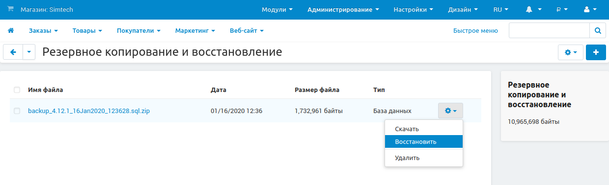

***********************************************
Как восстановить базу данных из резервной копии
***********************************************

.. note::

    **Сложность инструкции: 1 / 3**

1. Перейдите на страницу **Администрирование → Резервное копирование и восстановление** в панели администратора.

   .. note::

       Архивы с резервными копиями из списка хранятся в папке *var/backups* вашего магазина. 

2. Нажмите на кнопку с изображением шестеренки в правом верхнем углу страницы. Выберите **Загрузить файл** и укажите, откуда его загружать:

   * с вашего компьютера;
 
   * с сервера, где установлен CS-Cart;

   * по URL, то есть по прямой ссылке на файл резервной копии.
 
3. Нажмите кнопку **Загрузить**.

Если файл с резервной копией уже лежит в папке *var/backups*, можно использовать его. Нажмите кнопку с изображением шестеренки у этого файла и выберите **Восстановить**.

.. warning::

    При восстановлении резервной копии базы данных таблицы существующие таблицы будут перезаписаны.

.. note::

    Если нужно восстановить не только базу данных, но и файлы, у этих файлов должно быть разрешение на запись.
