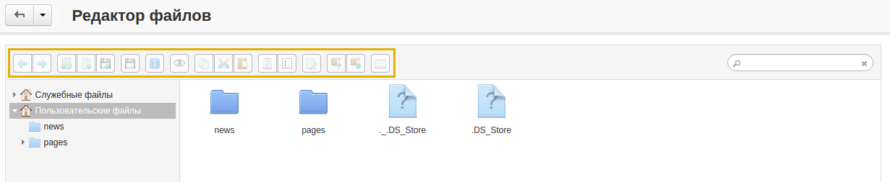

*****
Файлы
*****

Перейдя на страницу **Администрирование → Файлы**, вы попадёте в **Редактор файлов**, с помощью которого можно напрямую через панель администратора работать с различными файлами.

Выделенные на изображении ниже кнопки позволяют создавать, загружать, переименовывать и удалять файлы. Вы также можете редактировать **.txt**-файлы и создавать/распаковывать архивы.
 

В левой части редактора находятся две вкладки:

* **Служебные файлы**—файлы, хранящиеся в директории установки *var/files*.

* **Пользовательские файлы**—файлы, харанящиеся в директории установки *images/companies*.

Для поиска определённых файлов или папок используется поиск, расположенный в верхнем правом углу редактора.

.. toctree::
    :maxdepth: 2
    :titlesonly:
    :glob:

    *
