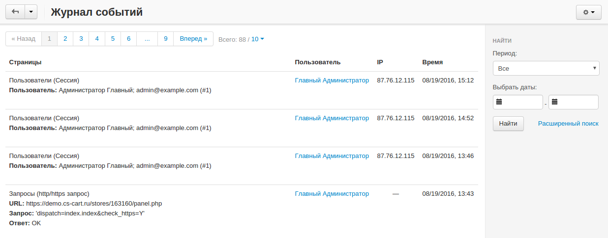

**************
Журнал событий
**************

Журнал событий магазина располагается по адресу **Администрирование → Журнал событий**. Вы можете фильтровать записи по периодам. Для доступа к дополнительным фильтрам, щёлкните ссылку **Расширенный поиск**.

.. hint::
    
    Если при поиске вы часто пользуетесь определённым шаблоном, вы можете сохранить его. Для этого, настройте характеристики поиска, введите название для шаблона в поле **Сохранить этот поиск как**, и нажмите кнопку **Сохранить**. После сохранения шаблон появиться в выпадающем списке сверху.

Некоторые действия также доступны с помощью кнопки **шестерёнки**:

* **Настройки** — перенаправляет на странице настроек журнала событий.

* **PHP-информация** — просмотр информации о текущей версии PHP.

* **Резервное копирование и восстановление** — перенаправляет на страницу с настройками базы данных.

* **Очистить логи** — удаляет все записи из журнала событий.

Список логов включает следующие колонки:

* **Время** — дата и время записи события.

* **Пользователь** — пользователь, действие которого отражено в логе.

* **Тип** — описание действия, и к чему оно относится (категории, база данных, новости, заказы, товары, запросы или пользователи).

* **Страницы** — содержание записи.

* **IP** — IP-адрес пользователя, выполнившего действие.
