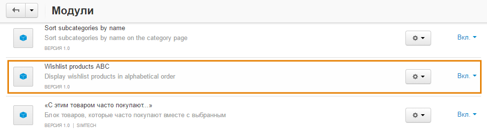

*****************************************************
Как показывать отложенные товары в алфавитном порядке
*****************************************************

По умолчанию CS-Cart показывает отложенные товары в том порядке, в котором они были отложены. Но есть бесплатный модуль **Wishlist Products ABC**, который меняет этот порядок на алфавитный.

.. image:: img/wishlist_products_abc_04.png
    :align: center
    :alt: Модуль для отображения отложенных товаров в алфавитном порядке на витрине

================
Установка модуля
================

1. Скачайте архив с модулем на компьютер по `этой ссылке. <https://github.com/cscart/addon-wishlist-sort/archive/master.zip>`_

.. note::

    У модуля есть свой `репозиторий на GitHub. <https://github.com/cscart/addon-wishlist-sort>`_

2. Войдите в панель администратора вашего магазина.

3. Откройте страницу **Модули → Управление модулями**.

4. Нажмите кнопку **+**, чтобы установить модуль из архива.

.. image:: img/addons_plus_button.png
    :align: center
    :alt: Кнопка плюс на странице модулей

5. Во всплывающем окне нажмите кнопку **Загрузить** и выберите архив с модулем.

6. Нажмите **Загрузить и установить**.

.. image:: img/upload_and_install_addon.png
    :align: center
    :alt: Окно загрузки и установки

После установки модуль **Wishlist Products ABC** появится в списке модулей. По умолчанию модуль включен и сразу начинает работу.

