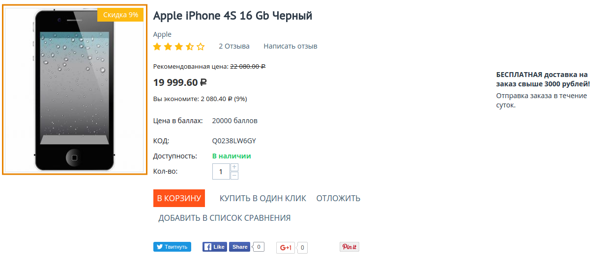
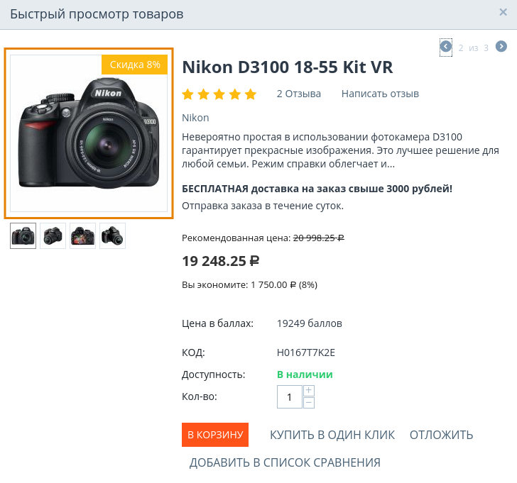
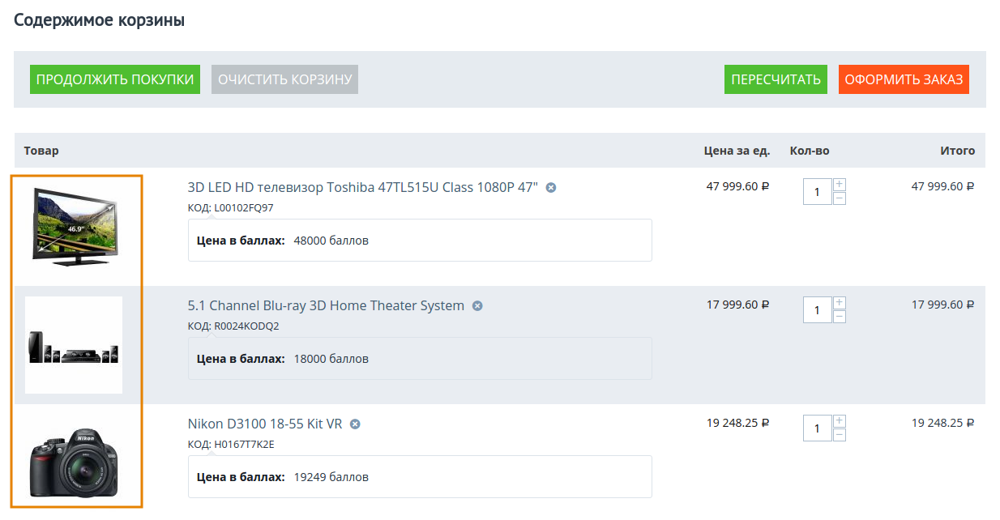
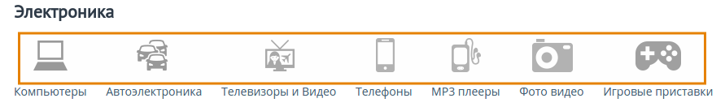
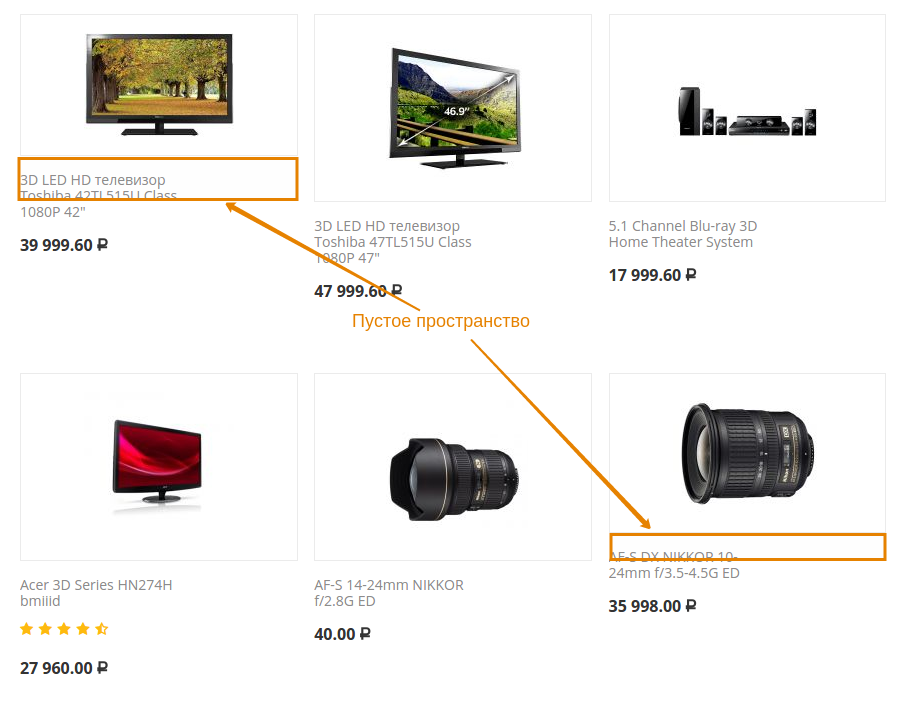

******************************************
Как изменить размер изображения на витрине
******************************************

================
Общая информация
================

Для того, чтобы изменить размер изображений на витрине, выполните следующие шаги:

1. Откройте страницу **Настройки → Иконки** в панели администратора.

   .. image:: img/change_image_size.png
        :align: center
        :alt: Чтобы настроить размер изображений на различных страницах, заполните соответствующие поля

2. Укажите нужное качество изображения в поле **Качество формата JPEG (0—100)**.

3. Чтобы настроить размер изображений на витрине, заполните соответствующие поля рядом с нужным типом иконки.

4. Нажмите **Сохранить**, чтобы сохранить изменения.

.. note::

    После внесения изменений потребуется очистить кэш иконок, чтобы система могла автоматически создать новые иконки. Для этого в панели администратора откройте **Администрирование → Хранилище данных** и нажмите **Удалить сгенерированные иконки**.

==========================
Типы иконок и их настройки
==========================

Здесь описано, какие настройки на странице **Настройки → Иконки** отвечают за иконки на определенных страницах магазина.

--------------
Список товаров
--------------

**Настройки:**

* *Ширина иконки в списке товаров (страницы категории, поиска и т.д.)*

* *Высота иконки в списке товаров (страницы категории, поиска и т.д.)*

В CS-Cart списков товаров отображается в двух случаях: 

* На страницах категорий, например, в категории "Электроника", "Одежда" и т.д. Эти страницы представлены :doc:`страницей макета <../layouts/layout_pages/index>`, у которой значением настройки *Страница* является ``cateogries.view``.

  .. image:: img/change_image_size_02.png
        :align: center
        :alt: Иконки списка товаров на витрине

* В :doc:`блоке <../layouts/blocks/index>` **"Товары"**, который на разных страницах может выполнять разные функции, например, *"Горячие предложения"*, *"Распродажа"*, *"Новые поступления"* и т.д.

  .. image:: img/change_image_size_03.png
       :align: center
       :alt: Иконки списка товаров на витрине

-------------------------
Детальная страница товара
-------------------------

**Настройки**:

* *Ширина иконки на детальной странице товара*

* *Высота иконки на детальной странице товара*

----------------------------------
Страница быстрого просмотра товара
----------------------------------

**Настройки:**

* *Ширина иконки товара в быстром просмотре*

* *Высота иконки товара в быстром просмотре*

----------------
Страница корзины
----------------

**Настройки:**

* *Ширина иконки на странице корзины*

* *Высота иконки на странице корзины*

----------------
Иконки категорий
----------------

**Настройки:**

* *Ширина иконки в списке категорий*

* *Высота иконки в списке категорий*

.. important::

    Настройки, указанные ниже, больше не используются в ядре CS-Cart.

* *Ширина иконки на детальной странице категории*

* *Высота иконки на детальной странице категории*

* *Ширина детального изображения категории*

* *Высота детального изображения категории*

====================================================
Что происходит с изображениями при изменении размера
====================================================

Если ширина или высота изображения больше, чем указано в настройках, то размер изображения уменьшается. При этом соотношение сторон сохраняется. Дальше возможно 2 варианта:

* Если в настройках задана и ширина, и высота, то уменьшенное изображение центрируется, а незанятое им место заполняется фоновым цветом.

* Если в настройках указана или только ширина или только высота, то размер изображения уменьшается до заданного, а отсутствующий параметр подбирается по соотношению сторон оригинального изображения.

Если ширина или высота изображения меньше, чем указано в настройках, то изображение не растягивается. Оно центрируется, а отсутствующий параметр подбирается по соотношению сторон оригинального изображения. Незанятое место заполняется фоновым цветом.

Фоновой цвет определяется настройкой **Цвет фона иконок**.

.. important::

    Если для изображений указать только ширину или только высоту, то сетка товаров может стать неровной. 

