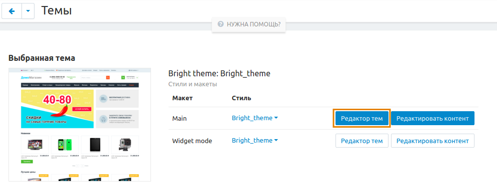
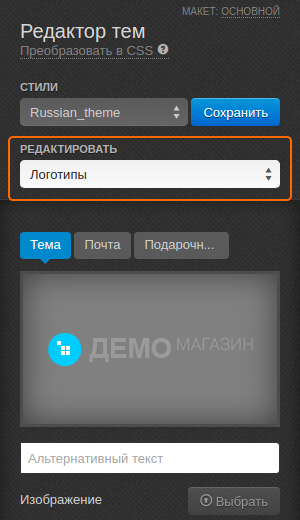

*****************************
Как изменить логотип компании
*****************************

1. В панели администратора откройте страницу **Дизайн → Темы**.

2. В разделе **Выбранная тема** нажмите кнопку **Редактор тем**.

3. В **Редакторе тем** выберите **Логотипы** из выпадающего списка под надписью **Редактировать**.

4. Переключайтесь между вкладками **Тема**, **Почта** и **Подарочный сертификат**, чтобы изменить соответствующие логотипы. Для загрузки изображений нажмите кнопку **Выбрать**.

5. Когда загрузите изображение, нажмите **Сохранить**.

.. important ::

    Стили по умолчанию изменять нельзя. Для сохранения изменений потребуется создать свой стиль: нажмите кнопку **Сохранить** рядом с выбранным стилем и во всплывающем окне введите название нового стиля.

.. image:: img/logo_03.png
    :align: center
    :alt: Всплывающее окно для сохранения нового стиля

