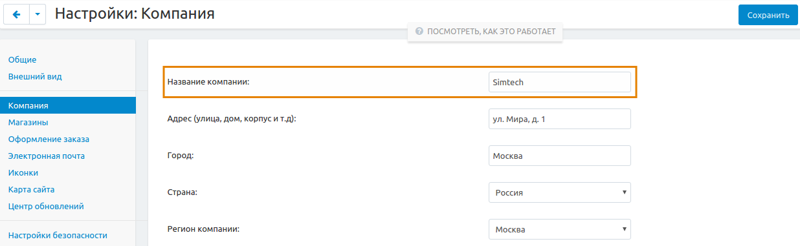
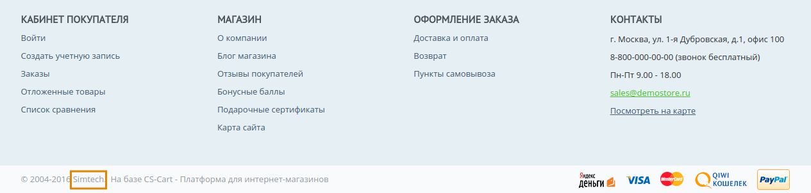

******************************
Как изменить название компании
******************************

1.   In the Administration panel, go to **Settings → Company**.
2.   In the opened page edit the **Company name** field.
3.   Click the **Save** button.

1. В панели администратора откройте **Настройки → Компания**.

2. На странице настроек отредактируйте поле **Название компании**.

3. Щёлкните **Сохранить**.

.. note::

    The company name is displayed on the storefront at the bottom of a page. Also it is assigned to the storefronts in **Administration → Stores → [storefront name] → Settings: Company**.
    На витрине название компании располагается в конце страницы. Также витринам можно присваивать отдельные названия компаний. Для этого откройте **Администрирование → Магазины → [название нужной витрины] → Настройки: Компания** и измените название компании на подходящее.
 

