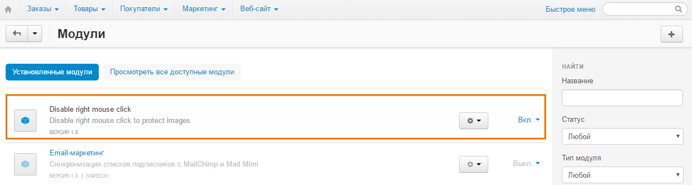
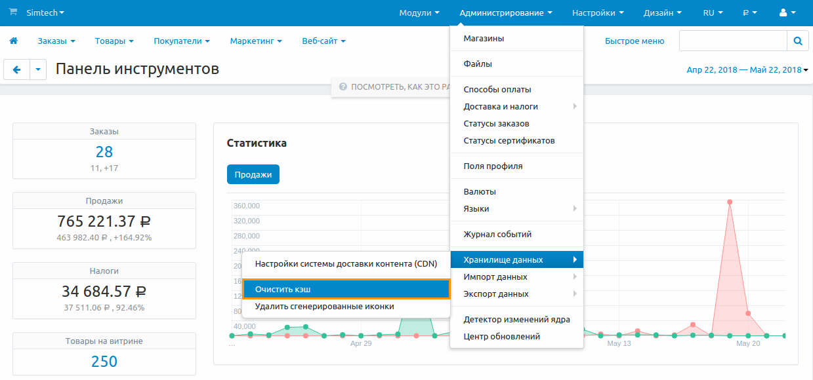

**********************************************************
Как отключить щелчок правой кнопкой для защиты изображений
**********************************************************

В большинстве браузеров существует возможность копирования изображений с веб-сайтов, для этого достаточно щёлкнуть мышью по картинке и выбрать соответствующее действие. Для защиты своих изображений от копирования, отключите щелчок правой нопкой мыши на картинках в вашем магазине.

.. note::

    Отключение щелчка правой кнопкой служит дополнительной защитой от копирования, но не защищает ваши изображения полностью. Существуют другие способы копирования изображений с веб-сайтов. Например, пользователь, может просто сохранить веб-страницу, а вместе с ней и все изображения на свой компьютер.

Для этого воспользуйтесь модулем **Disable Right Mouse Click**. 

Для загрузки и установки модуля, выполните следующие действия:

1. Загрузите архив модуля на компьютер, щёлкнув по `приведённой ссылке <https://github.com/cscart/addon-disable-right-click/archive/master.zip>`_.

.. note::

    If you want to check the add-on code, please, visit `the add-on page on GitHub <https://github.com/cscart/addon-disable-right-click>`_.

2. Войдите в панель администратора вашего магазина.

3. Откройте страницу **Модули → Управление модулями**.

4. Для загрузки модуля щёлкните по кнопке **+**.

.. image:: img/addons_plus_button.png
    :align: center
    :alt: Кнопка плюс на странице модулей

5. Во всплывающем окне щёлкните по кнопке **Загрузить** и выберите файл архива.

6. Щёлкните **Загрузить и установить**.

.. image:: img/upload_and_install_addon.png
    :align: center
    :alt: Окно загрузки и установки

Модуль **Disable Right Mouse Click** установлен и готов к работе

.. note::

    Щелчок правой кнопкой будет отключен сразу после установки и запуска модуля.

.. note::

    Если после установки модуля изменения не отображаются, очистите кэш вашего магазина. В панели администратора откройте **Администрирование → Хранилище данных** и щёлкните по кнопке **Очистить кэш**.

