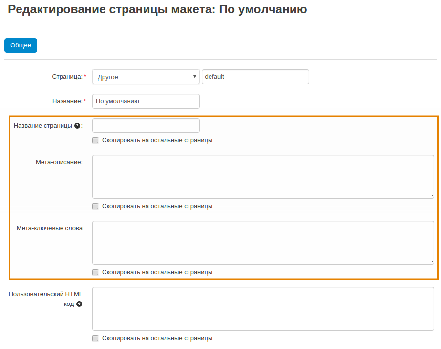
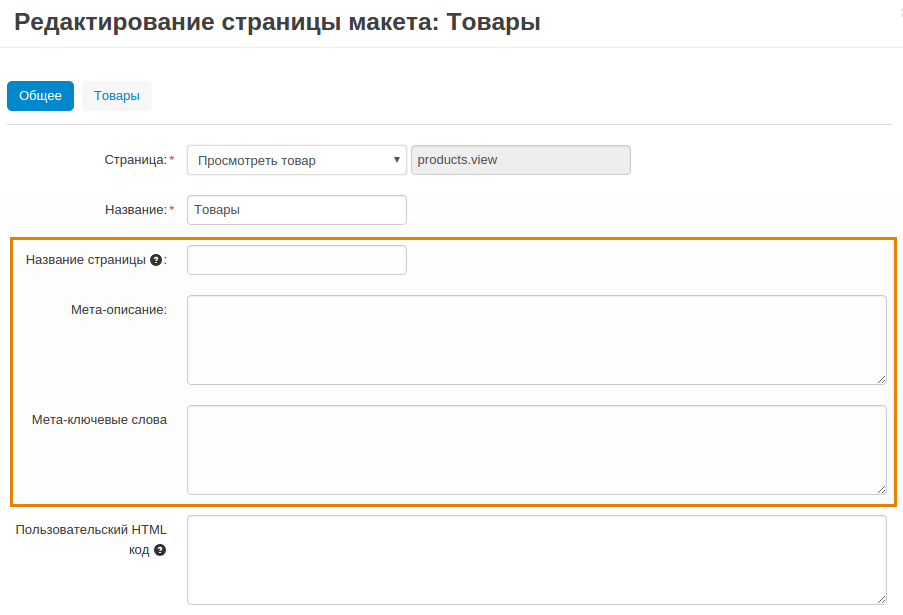
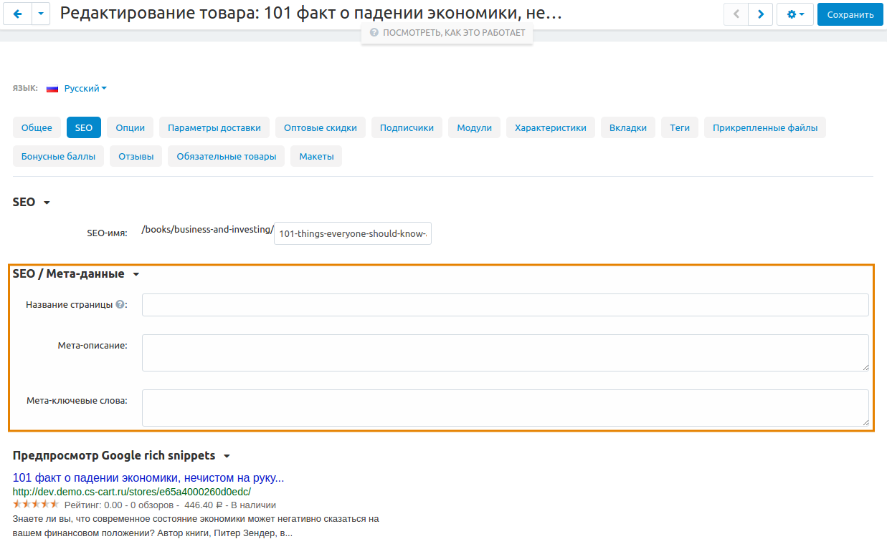

*********************************
Как изменить мета-данные страницы
*********************************

**Мета-данные** — это данные, предоставляющие информацию о других данных. Мета-данные помогают поисковым движкам определять содержание страниц. Мета-данные не отображаются на страницах магазина, кроме названия страницы, которое присутствует на вкладке браузера.

В CS-Cart используется три типа мета-данных:

* **Название страницы** — название страницы на витрине, которое отображается на вкладке браузера при посещении магазина. 

* **Мета-описание** — содержимое HTML мета-тега, описывающего страницу.

* **Мета-ключевые слова** — содержимое HTML мета-тега, включающее список ключевых слов для поиска страницы.

Мета-данные в CS-Cart можно описать в виде трёхступенчатой иерархии:

* Мета-данные :doc:`страницы макета по умолчанию. <../layouts/layout_pages/index>`

* Мета-данные определенной страницы макета, отвечающей за какой-то тип страниц на витрине.

* Мета-данные отдельного товара, категории и пр.

===============================================
Изменение мета-данных для страницы по умолчанию
===============================================

1. В панели администратора откройте **Дизайн → Макеты**.

2. Щёлкните по значку **шестерёнки** на вкладке **По умолчанию**.

.. note::

    Если вы выбрали другую страницу макета страницей по умолчанию, редактируйте ее.

3. В открывшемся окне отредактируйте поля **Название страницы**, **Мета-описание** и **Мета-ключевые слова**.

4. Нажмите **Сохранить**.

======================================================
Изменение мета-данных для определённой страницы макета
======================================================

1. В панели администратора откройте **Дизайн → Макеты**.

2. Щёлкните по значку **шестерёнки** на выбранной вкладке.

3. В открывшемся окне отредактируйте поля **Название страницы**, **Мета-описание** и **Мета-ключевые слова**.

4. Нажмите **Сохранить**.

========================================
Изменение мета-данных отдельного объекта
========================================

1. В панели администратора откройте нужную страницу (например, для изменения мета-данных *Детальной страницы определённого товара*, откройте **Товары → Товары**) и щёлкните по названию товара.

2. Переключитесь на вкладку **SEO**.

3. В открывшемся окне найдите раздел **Мета-данные** и отредактируйте поля **Название страницы**, **Мета-описание** и **Мета-ключевые слова**.

4. Нажмите **Сохранить**.

.. note:: 

    Для добавления **Мета-данных** с помощью функции `импорта <http://docs.cs-cart.com/4.3.x/user_guide/manage_products/import_export/product_import.html>`_, воспользуйтесь инструкцией из статьи `"Формат полей импорта" <http://docs.cs-cart.com/4.3.x/user_guide/manage_products/import_export/fields_format.html>`_.
