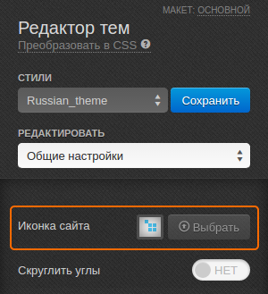

*************************
Как изменить иконку сайта
*************************

1. В панели администратора откройте **Дизайн → Темы**.

2. В секции **Выбранная тема** щёлкните по кнопке **Редактор тем**.

3. Слева, в панели **Редактора тем**, найдите строку **Иконка сайта** и щёлкните **Выбрать**.

4. Загрузите подходящее изображение размером 16x16 пикселей и щёлкните **Сохранить**.

.. important ::

	Стили по умолчанию изменять нельзя. Для сохранения изменений потребуется создать свой стиль: щёлкните по кнопке **Сохранить** рядом с выбранным стилем и во всплывающем окне введите название нового стиля.

.. image:: img/logo_03.png
    :align: center
    :alt: Всплывающее окно для сохранения нового стиля
