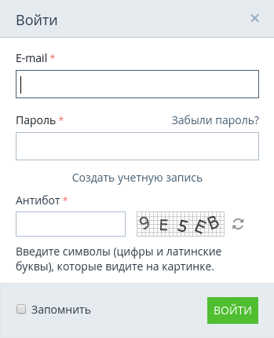
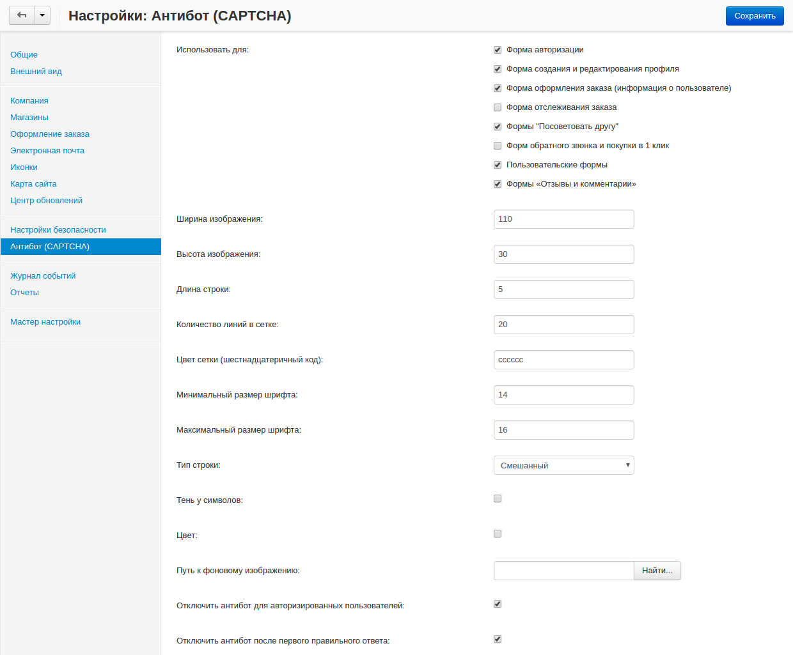

*******************************
Как настроить антибот (CAPTCHA)
*******************************

**Антибот (CAPTCHA)** служит для подтверждения того, что различные действия в магазине (создание аккаунта, вход в магазин, публикование комментариев и т.д.) совершаются человеком. Если антибот включен и настроен, пользователю при совершении определённых действий потребуется ввести текст со случайно сгенерированной картинки, чтобы подтвердить, что он или она является человеком.

На изображении ниже видно, что при включенном антиботе добавляется новое обязательное поле **Антибот**.

Чтобы включить антибот в своём магазине, выполните следующие шаги:

1. В панели администратора, откройте **Настройки → Антибот (CAPTCHA)**.

2. Поставьте галочки рядом с нужными полями в секции **Использовать для**.

3. Остальные поля заполните по своему усмотрению.

4. Нажмите **Сохранить**.

.. important::

    Для отображения CS-Cart изображений, используемых антиботом, на вашем сервера должна быть установлена **GD библиотека**. PHP должен быть собран с поддержкой **freetype**. Такми образом, PHP должен быть настроен с использованием следующих ключей: ``--with-gd --enable-gd-native-ttf``.

