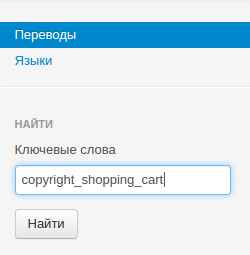
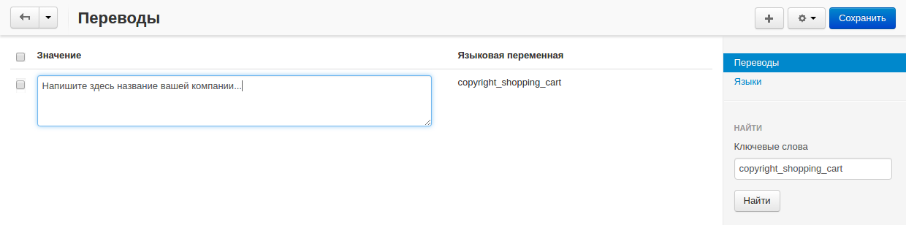

****************************************************
Как заменить или удалить ссылку "На базе CS-Cart..."
****************************************************

=============
Замена ссылки
=============

Для того, чтобы заменить ссылку **На базе CS-Cart — Платформа для интернет-магазинов** на свою:

1. В панели администратора откройте **Администрирование → Языки → Переводы**.

2. Справа, в секции **Найти**, в поле **Ключевые слова** ввести *copyright_shopping_cart* и щёклнуть **Найти**.

.. note::

    При работе с переводами обратите внимание на язык **Значений** в левом верхнем углу.

3. Отредактируйте найденную языковую переменную (например, введите название вашей компании) и щёлкните **Сохранить**.

.. note ::

    Если изменения не отображаются, очистите кэш вашего магазина. В панели администратора откройте **Администрирование → Хранилище данных** и щёлкните по кнопке **Очистить кэш**.

===============
Удаление ссылки
===============

Для того, чтобы удалить ссылку **На базе CS-Cart — Платформа для интернет-магазинов**:

1. В панели администратора откройте **Дизайн → Макеты**

2. Переключитесь на вкладку **По умолчанию**

.. image:: img/powered_by_03.png
    :align: center
    :alt: Вкладка "По умолчанию"

3. В **Подвале** страницы найдите блок под названием **Копирайт**, щёлкните по значку **мусорной корзины** на блоке и удалите его. Также, вместо удаления вы можете выключить блок. Щёлкните по значку **Вкл./Выкл.**, чтобы выключить его.

.. image:: img/powered_by_04.png
    :align: center
    :alt: Блок "Копирайт"

