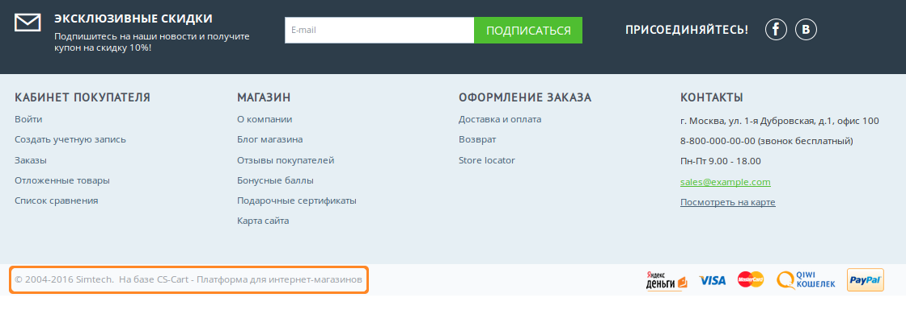
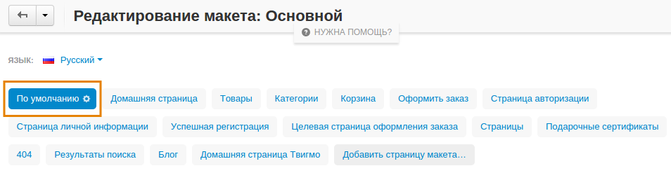
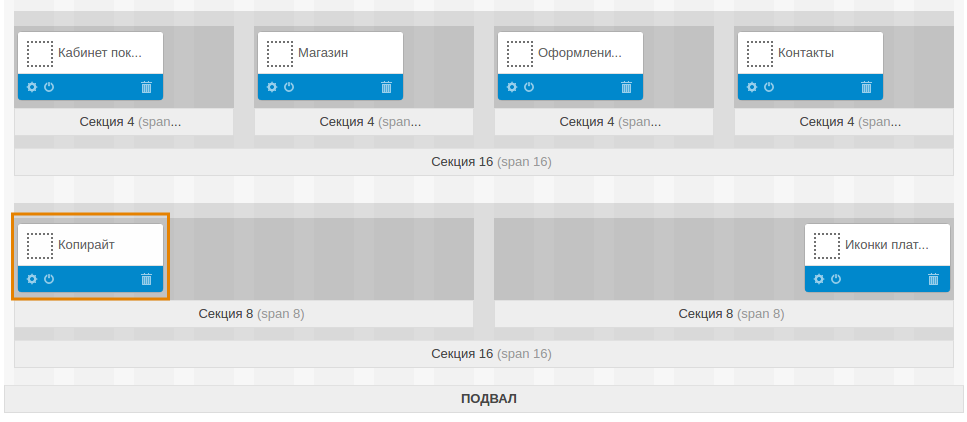
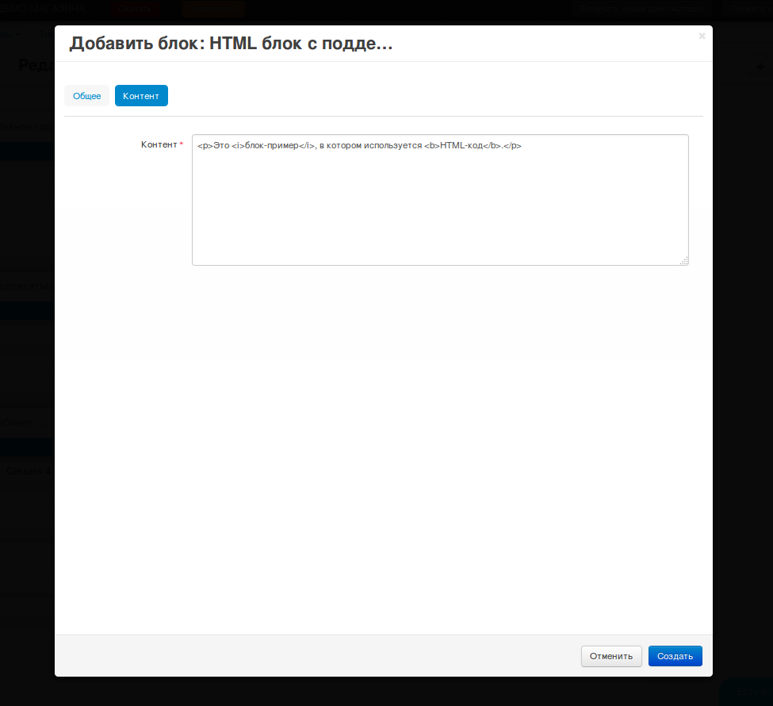

****************************************************
Как заменить или удалить ссылку "На базе CS-Cart..."
****************************************************

По умолчанию в нижней части страницы есть ссылка наподобие:

 © 2004-2017 Simtech.  На базе `CS-Cart - Платформа для интернет-магазинов <http://www.cs-cart.ru/>`_

В этой статье описано, как удалить эту ссылку или заменить ее на что-то другое.

.. note ::

    Если после действий, описанных в статье, на витрине магазина ничего не изменилось, попробуйте :doc:`очистить кэш шаблонов.  <../../../../developer_guide/addons/tutorials/addon_creation/cache>`

==============
Удаляем ссылку
==============

1. В панели администратора откройте страницу **Дизайн → Макеты**.

2. Переключитесь на вкладку **По умолчанию**.

3. В **Подвале** страницы найдите блок под названием **Копирайт** и нажмите на значок **корзины** на блоке, чтобы удалить блок. 

.. hint::

    Вместо удаления вы можете просто выключить блок. Для этого нажмите на значок **Вкл./Выкл.** на блоке.

=============
Меняем ссылку
=============

1. Сначала удалите ссылку, как описано выше.

2. Нажмите на значок **+** у той секции, в которой раньше был блок **Копирайт**. Выберите **Добавить блок**.

.. image:: img/add_new_block.png
    :align: center
    :alt: Добавляем новый блок в секцию, где раньше был копирайт.

3. Откроется окно добавления блока. Здесь можно создать новый блок или выбрать один из существующих.

   Например, можно переключиться на вкладку **Создать новый блок** и создать **HTML блок с поддержкой Smarty**. Появится окно создания блока, состоящее из 2 вкладок:

   * **Общее**—задайте здесь название блока.

   * **Контент**—введите здесь код или текст, который должен появиться на витрине.

   Когда вы настроите блок, нажмите кнопку **Создать**.

После этого новый блок должен появиться на витрине вместо старой ссылки. Если вы не видите никаких изменений, попробуйте :doc:`очистить кэш шаблонов. <../../../../developer_guide/addons/tutorials/addon_creation/cache>`
