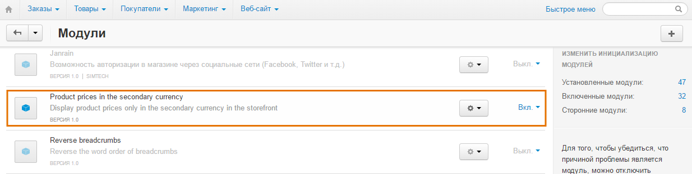
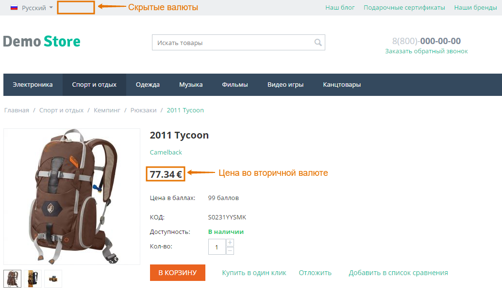

*********************************************************************
Как показывать цены товаров на витрине только в дополнительной валюте
*********************************************************************

Для этого воспользуйтесь модулем **Product Prices in the Secondary Currency**.

=======================
Шаг 1. Установка модуля
=======================

Для загрузки и установки модуля, выполните следующие действия:

1. Загрузите архив модуля на компьютер, щёлкнув по `приведённой ссылке <https://github.com/cscart/addon-hide-primary-currency/archive/master.zip>`_.

.. note::

    Вы можете изучить код модуля, посетив `его страницу на GitHub <https://github.com/cscart/addon-hide-primary-currency>`_. 

2. Войдите в панель администратора вашего магазина.

3. Откройте страницу **Модули → Управление модулями**.

4. Для загрузки модуля щёлкните по кнопке **+**.

.. image:: img/addons_plus_button.png
    :align: center
    :alt: Кнопка плюс на странице модулей

5. Во всплывающем окне щёлкните по кнопке **Загрузить** и выберите файл архива.

6. Щёлкните **Загрузить и установить**.

.. image:: img/upload_and_install_addon.png
    :align: center
    :alt: Окно загрузки и установки

Модуль **Product Prices in the Secondary Currency** установлен.

======================================
Шаг 2. Настройка дополнительной валюты
======================================

Для отображения нужной дополнительной валюты на витрине, необходимо внести изменения в коде установленного модуля.

1. Откройте папку **hide_primary_currency**, расположенную в директории *app/addons* вашей установки CS-Cart.

2. В данной папке откройте файл **func.php**.

3. Замените ``DESIRED_ADMIN_CURRENCY_CODE`` на трёхзначный код валюты (RUB, USD, EUR и т.п.), которую вы хотите использовать в панели администратора, также замените ``DESIRED_STOREFRONT_CURRENCY_CODE`` на трёхзначный код валюты, которую вы будете использовать на витрине.

.. image:: img/prices_in_secondary_currency_02.png
    :align: center
    :alt: Трёхзначный код валюты.

4. Щёлкните **Save changes**.

Модуль для отображения товаров на витрине в дополнительной валюте готов к работе.

.. important ::

    После установки данного модуля все валюты, кроме указанной, не будут отображаться на витрине. Если Вы хотите сохранить возможность выбора валюты для покупателей, но сделать нужную валюту выбранной по умолчанию, воспользуйтесь инструкциями из `этой статьи <http://docs.cs-cart.com/4.3.x/user_guide/look_and_feel/changing_attributes/secondary_currency.html>`_.

