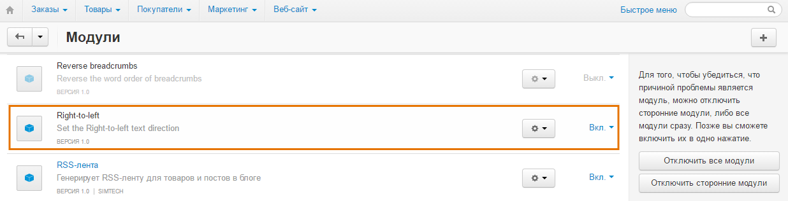
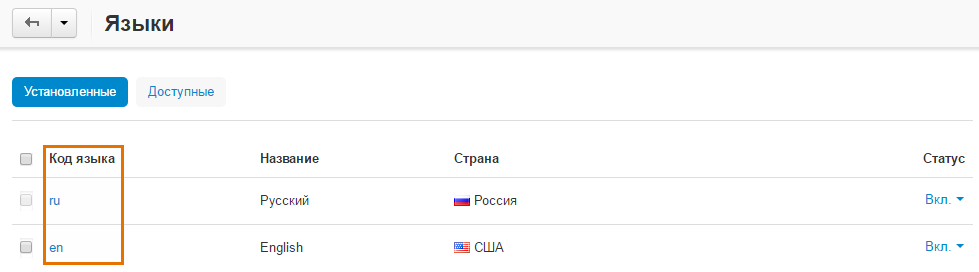

*******************************************************************
Изменение направления текста при использовании письма справа налево
*******************************************************************

В некоторых случаях, например, при работе с арабским языком, может потребоваться изменить направление текста. Для этого воспользуйтесь модулем **Right-to-Left**.

=======================
Шаг 1. Установка модуля
=======================

Для загрузки и установки модуля, выполните следующие действия:

1. Загрузите архив модуля на компьютер, щёлкнув по `приведённой ссылке <https://github.com/cscart/addon-rtl-text-layout/archive/master.zip>`_.

.. note::

    Вы можете изучить код модуля, посетив `его страницу на GitHub <https://github.com/cscart/addon-rtl-text-layout>`_.

2. Войдите в панель администратора вашего магазина.

3. Откройте страницу **Модули → Управление модулями**.

4. Для загрузки модуля щёлкните по кнопке **+**.

.. image:: img/addons_plus_button.png
    :align: center
    :alt: Кнопка плюс на странице модулей

5. Во всплывающем окне щёлкните по кнопке **Загрузить** и выберите файл архива.

6. Щёлкните **Загрузить и установить**.

.. image:: img/upload_and_install_addon.png
    :align: center
    :alt: Окно загрузки и установки

Модуль **Right-to-Left** установлен.

=============================
Шаг 2. Настройка языка
=============================

Для изменения направления текста, необходимо внести изменения в коде установленного модуля. 

.. note::

    Модуль разработан для темы **Responsive**. **Responsive** является темой по умолчанию в CS-Cart и Multi-Vendor.

1. Откройте папку **rtl_text_layout**, расположенную в директории *design/themes/responsive/templates/addons/hooks/index* вашей установки CS-Cart.

2. В данной папке откройте файл **html_tag.pre.tpl**.

3. Замените ``[YOUR_LANGUAGE_CODE]`` кодом языка, используемого для написания справа налево.

4. Щёлкните **Save changes**.

Модуль **Right-to-Left** готов к работе.

.. important ::

    Изменения направление текста работает будет работать только в том случае, если покупатель на витрине выберет язык, указанный в файле **html_tag.pre.tpl**. Важно отметить, что даже в этом случае, изменение направления будет работать не для всех и только для базового текстовго контента.

    Для включения полной поддержки написания текстов справа налево потребуются дополнительные изменения в коде. Более подробно об этом можно узнать `здесь <http://codex.wordpress.org/Right_to_Left_Language_Support>`_. Также вы можете обратиться в нашу службу разработки пользовательских модификаций.
