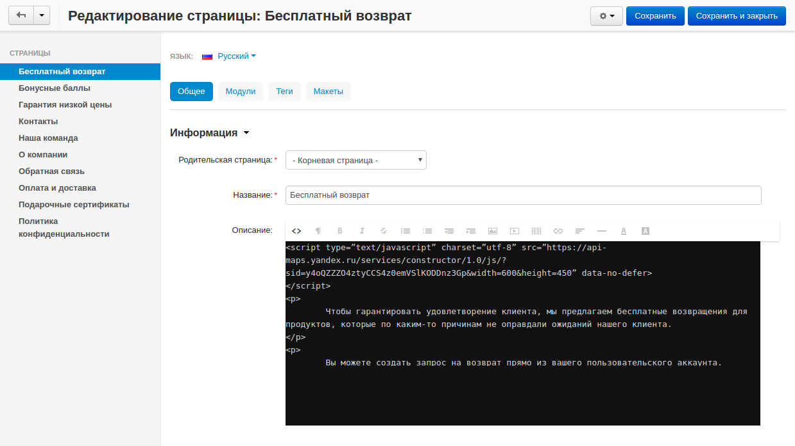

**************************************************************************
Встроенный скрипт отображается после всего остального содержимого страницы
**************************************************************************

Возможно, вы сталкивались с проблемой, когда встроенные скрипты отображались после всего остального содержимого.

Например, в данном случае карта отображается в самом низу страницы:

Для решения данной проблемы, выполните следующие действия:

1. В панели администратора вашего магазина, откройте раздел редактирования страниц. В нашем случае это **Веб-сайт → Страницы → Бесплатный возврат**.

2. В поле **Описание** переключитесь на **Код** (значок **<>**).

3. Вставьте ваш скрипт в нужную часть кода, добавив к нему параметр ``data-no-defer``.

   Изначальный вариант кода::

     <script type="text/javascript" charset="utf-8" src="https://api-maps.yandex.ru/services/constructor/1.0/js/?sid=y4oQZZZO4ztyCCS4z0emVSlKODDnz3Gp&width=600&height=450">
    
   Изменённый вариант кода::

     <script type="text/javascript" charset="utf-8" src="https://api-maps.yandex.ru/services/constructor/1.0/js/?sid=y4oQZZZO4ztyCCS4z0emVSlKODDnz3Gp&width=600&height=450" data-no-defer>

4. Сохраните изменения, и проблема должна исчезнуть.

   В нашем случае страница стала выглядеть вот так:

