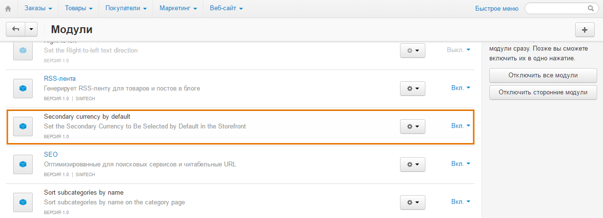
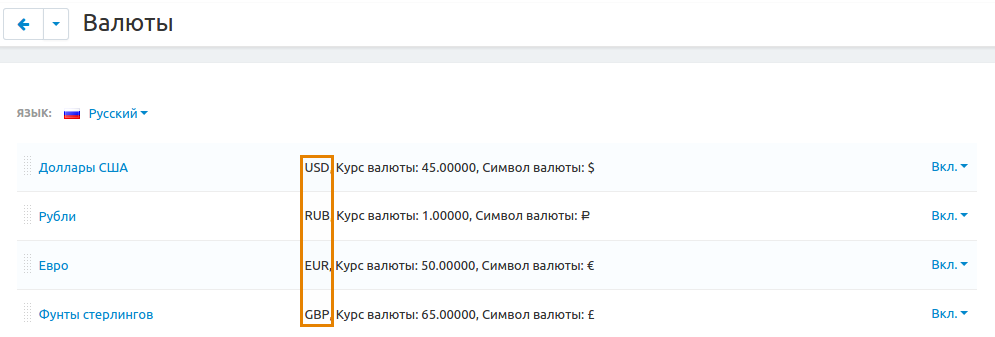
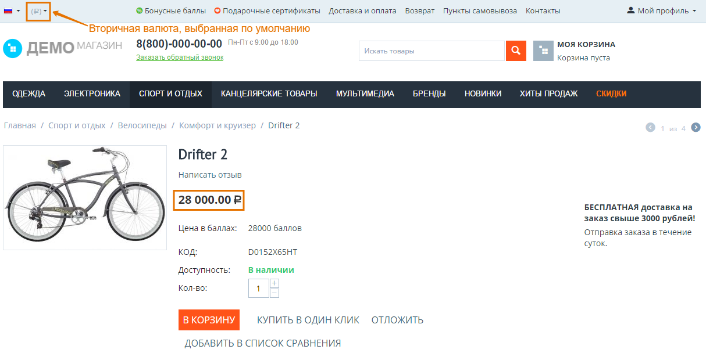

********************************************************************
Как сделать дополнительную валюту, выбранной на витрине по умолчанию
********************************************************************

Для этого воспользуйтесь модулем **Secondary Currency by Default**.

=======================
Шаг 1. Установка модуля
=======================

Для загрузки и установки модуля, выполните следующие действия:

1. Загрузите архив модуля на компьютер, щёлкнув по `приведённой ссылке <https://github.com/cscart/addon-default-secondary-currency/archive/master.zip>`_.

.. note::

    Вы можете изучить код модуля, посетив `его страницу на GitHub <https://github.com/cscart/addon-default-secondary-currency>`_.

2. Войдите в панель администратора вашего магазина.

3. Откройте страницу **Модули → Управление модулями**.

4. Для загрузки модуля щёлкните по кнопке **+**.

.. image:: img/addons_plus_button.png
    :align: center
    :alt: Кнопка плюс на странице модулей

5. Во всплывающем окне щёлкните по кнопке **Загрузить** и выберите файл архива.

6. Щёлкните **Загрузить и установить**.

.. image:: img/upload_and_install_addon.png
    :align: center
    :alt: Окно загрузки и установки

Модуль **Secondary Currency by Default** установлен.

=====================================================================
Шаг 2. Установка дополнительной валюты в качестве валюты по умолчанию
=====================================================================

Для отображения дополнительной валюты в качестве валюты по умолчанию, необходимо внести изменения в коде установленного модуля.

1. Откройте папку **default_secondary_currency**, расположенную в директории *app/addons* вашей установки CS-Cart.

2. В данной папке откройте файл **func.php**.

3. Замените ``DESIRED_CURRENCY_CODE`` на трёхзначный код валюты (RUB, USD, EUR и т.п.), которую вы хотите сделать выбранной на витрине по умолчанию.

4. Щёлкните **Save changes**.

Модуль дополнительной валюты по умолчанию готов к работе.

.. important ::
 
    Эти изменения сохранят возможность выбирать валюту в витрине, только указанная валюта будет выбрана по умолчанию. Если вы хотите спрятать все остальные валюты, кроме нужной, воспользуйтесь инструкциями из :doc:`этой статьи <../changing_attributes/prices_in_secondary>`.
