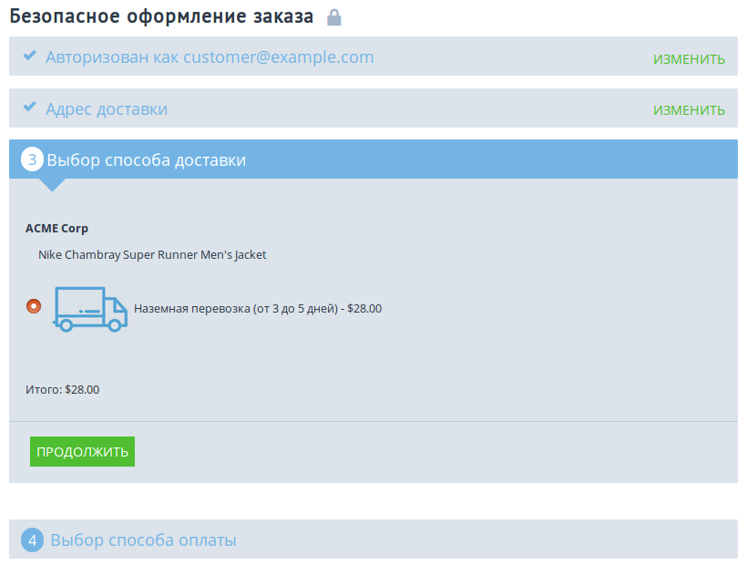

*********************************************************************
Как показывать иконки способов доставки на странице оформления заказа
*********************************************************************

.. warning::

    Изменения из этой статьи могут конфликтовать с модулями, использующими тот же хук.

Выведение иконок для способа доставки на витрину осуществляется в два шага:

=========================
Шаг 1. Перезаписываем хук
=========================

1.1. В корневой директории с установленным CS-Cart создайте следующий путь: */design/themes/[название_темы]/templates/addons/my_changes/hooks/checkout*.

     .. important ::

         Перед началом работы в панели администратора откройте страницу **Модули → Управление модулями** и убедитесь, что модуль **Мои изменения** установлен и включен.

1.2. Скачайте файл :download:`shipping_method.override.tpl <files/shipping_method.override.tpl>` и поместите его в директорию из пункта 1.1. Обратите внимание, что **файл подходит только для версии CS-Cart 4.3.7 и выше**.

     * Если у вас версия 4.3.6, скачайте :download:`этот файл <files/436shipping_method.override.tpl>` и переименуйте его в **shipping_method.override.tpl**.

     * Если у вас версия 4.3.5 и ниже, скачайте :download:`этот файл <files/435shipping_method.override.tpl>` и переименуйте его в **shipping_method.override.tpl**.

.. important::

    В файле задана ширина и высота иконки способа доставки в 100 пикселей. Чтобы задать другой размер иконок, в параметрах ``image_width`` и ``image_height`` введите собственные значения.

--------------------------------
Совместимость с другими модулями
--------------------------------

В некоторых случаях из-за использования одинакового хука модули могут работать некорректно. Если после шага 1 какой-то из ваших модулей перестал работать правильно, найдите файл **shipping_method.post.tpl**, расположенный по адресу */design/themes/responsive/templates/addons/[addon_name]/hooks/checkout*, где [addon_name] — название неработающего модуля. После того, как вы нашли этот файл, скопируйте его содержимое в конец файла **shipping_method.override.tpl** из шага 1.

=============================================
Шаг 2. Загружаем иконки для способов доставки 
=============================================

2.1. В панели администратора вашего магазина откройте страницу **Администрирование → Доставка и налоги → Способы доставки**.

2.2. Нажмите кнопку с изображением **шестеренки** рядом с нужным способом и выберите **Редактирвоать**.

2.3. На вкладке **Общее** в разделе **Иконка** загрузите нужное изображение.

2.4. Нажмите **Сохранить и закрыть**.

После этого иконки должны появиться рядом со способами доствики на странице оформления заказа.

.. note ::

    Если после выполнения всех инструкций иконки рядом с названиями способов доставки все равно не отображаются, попробуйте :doc:`очистить кэш шаблонов. <../../../developer_guide/addons/tutorials/addon_creation/cache>`

