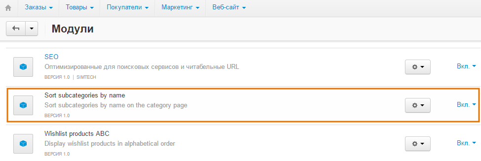
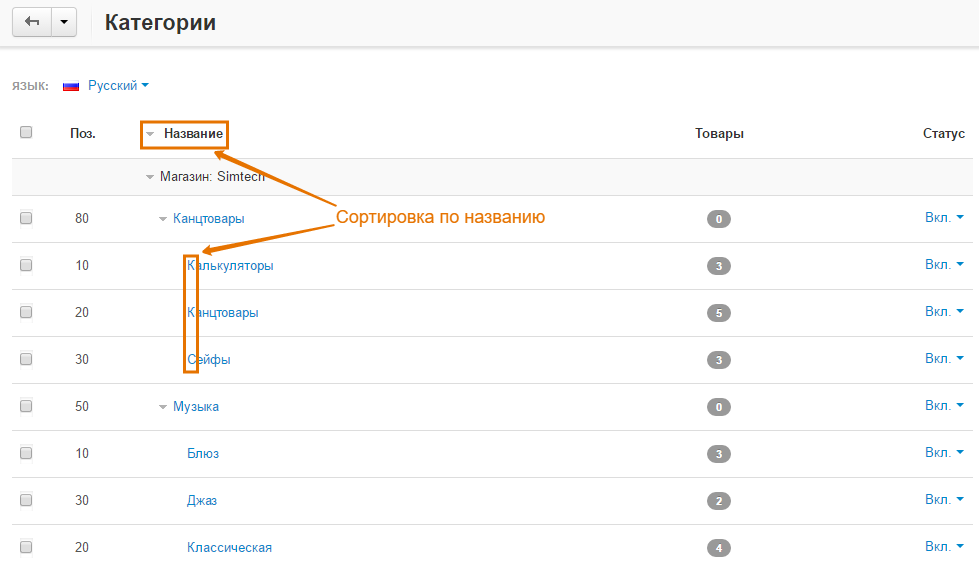

****************************************************************
Как отсортировать подкатегории по названию на странице категорий
****************************************************************

Для этого воспользуйтесь модулем **Sort Subcategories by Name**.

Для загрузки и установки модуля, выполните следующие действия:

1. Загрузите архив модуля на компьютер, щёлкнув по `приведённой ссылке <https://github.com/cscart/addon-subcategories-sort/archive/master.zip>`_.

.. note::

    Вы можете изучить код модуля, посетив `его страницу на GitHub <https://github.com/cscart/addon-subcategories-sort>`_.

2. Войдите в панель администратора вашего магазина.

3. Откройте страницу **Модули → Управление модулями**.

4. Для загрузки модуля щёлкните по кнопке **+**.

.. image:: img/addons_plus_button.png
    :align: center
    :alt: Кнопка плюс на странице модулей

5. Во всплывающем окне щёлкните по кнопке **Загрузить** и выберите файл архива.

6. Щёлкните **Загрузить и установить**.

.. image:: img/upload_and_install_addon.png
    :align: center
    :alt: Окно загрузки и установки

Модуль **Sort Subcategories by Name** установлен и готов к работе.

.. note::

    Подкатегории будут автоматически отсортированы по названию сразу после установки и запуска модуля.

