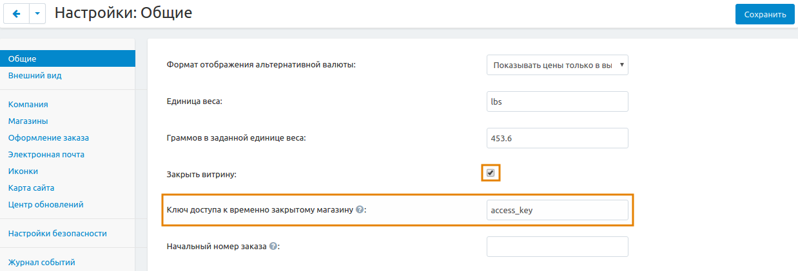
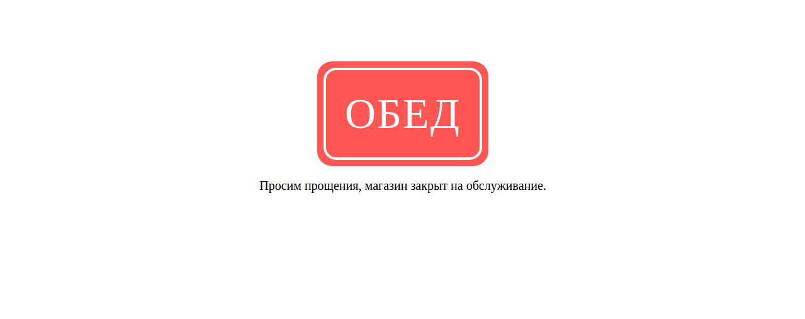

****************************
Как закрыть витрину магазина
****************************

В некоторых случаях вам может потребоваться закрыть витрину магазина для покупателей и поисковых движков, например, при глобальном редизайне или изменениях в структуре категорий и товаров.

Чтобы закрыть витрину, выполните следующие шаги:

1. В панели администратора откройте **Настройки → Общие**.

2. Отметьте галочкой панель **Закрыть витрину**.

3. В поле **Ключ доступа к временно закрытому магазину** введите комбинацию для доступа к витрине.

.. note::

    Используйте ключ доступа для просмотра закрытой витрины. Например, если ваш сайт доступен по адресу *http://example.com*, и в поле **Ключ доступа к временно закрытому магазину** вы ввели слово *secret*, получить доступ к закрытой витрине можно по адресу: *http://www.example.com/index.php?store_access_key=secret*.

4. Нажмите **Сохранить**

.. note::

    Также витрина автоматически закрывается во время :doc:`процесса обновления <../../../upgrade/upgrade_process>`. Вам потребуется открыть её вручную после завершения обновления.

