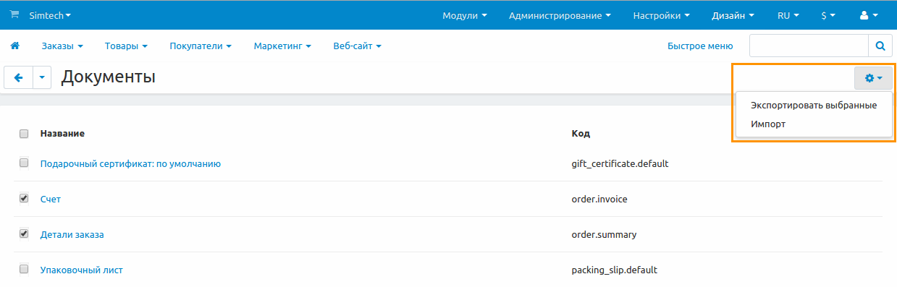

********************************************
Как экспортировать и импортировать документы
********************************************

.. contents::
   :backlinks: none
   :local:

==================
Экспорт документов
==================

1. Откройте **Администрирование → Уведомления → Документы**.

2. Отметьте галочкой документы, которые хотите экспортировать.

3. Нажмите на **кнопку с изображением шестерёнки** в правом верхнем углу страницы.

4. Нажмите **Экспортировать выбранные**. Начнётся процесс загрузки XML-файла, содержащего документы и их сниппеты.

=================
Импорт документов
=================

1. Откройте **Администрирование → Уведомления → Документы**.

2. Нажмите на кнопку с изображением шестерёнки в правом верхнем углу страницы.

3. Выберите **Импорт**.

4. В зависимости от расположения XML-файла, который вы хотите импортировать, нажмите на одну из трёх кнопок:

   * **Загрузить** — загрузка XML-файла непосредственно с компьютера пользователя.

   * **Сервер** — загрузка XML-файла с сервера, на котором установлен CS-Cart/Multi-Vendor.

   * **URL** — загрузка XML-файла по прямой ссылке на файл.

5. Нажмите **Импорт**. После этого документы и сниппеты будут импортированы в ваш магазин.

.. image:: img/select_xml.png
    :align: center
    :alt: Выбор XML-файла для импорта.

==========
Примечания
==========

* Все сниппеты, относящиеся к одному документу, экспортируются в XML-файле вместе с документом.

* Если при импорте коды (``<code>``) сниппетов совпадают, то существующий сниппет будет заменён импортируемым сниппетом с таким же кодом. То же самое касается и шаблонов email-уведомлений.

* Если в XML-файле изменить код (``<code>``) документа вручную, а затем импортировать данный файл, будет создан новый документ. Хотя новый документ и будет отображаться в списке на панели администратора, он не будет использоваться, если нет модуля, который использует данный документ.

  Однако можно создать новые документы на основе экспортированных документов “Счёт” и “Детали заказа”. Такие документы потом можно прикрепить в виде PDF-файла к :doc:`email-уведомлениям <../email_templates/index>`, касающимся изменений статуса заказа.
