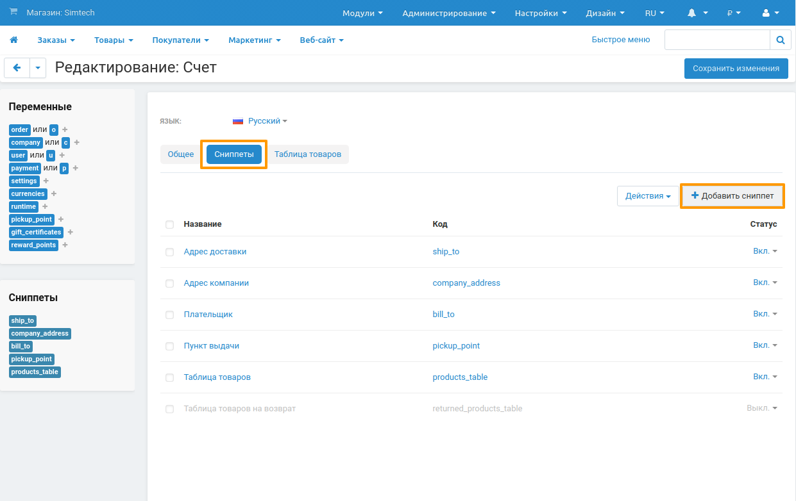
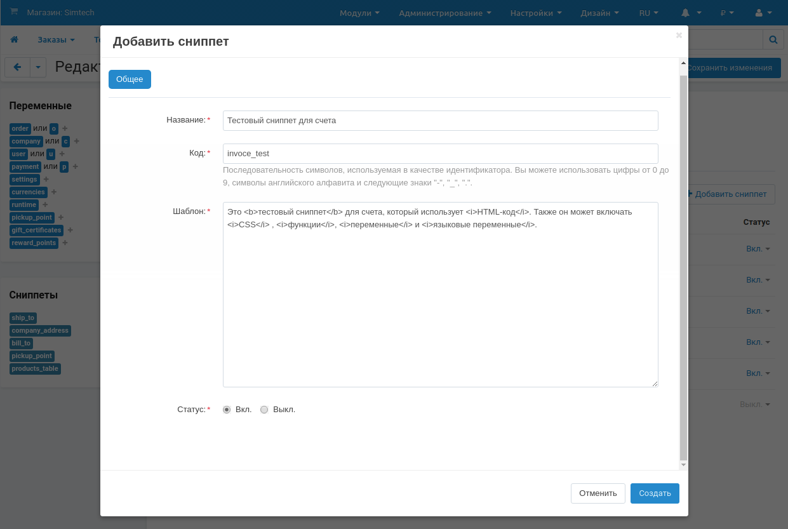
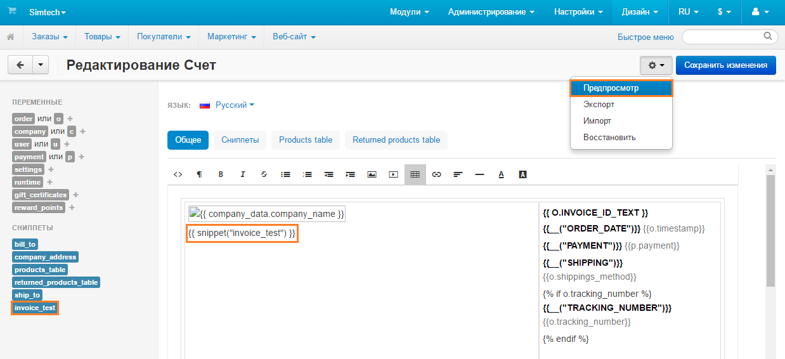
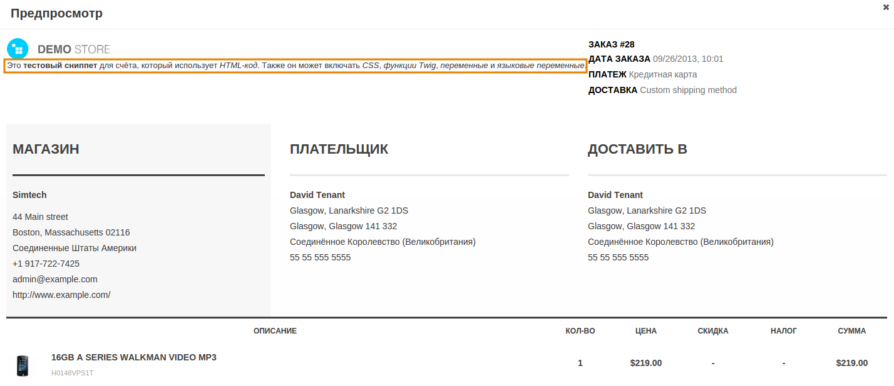

*********************
Сниппеты в документах
*********************

Некоторые документы могут показаться сложными, особенно в редакторе, где вместо текста и чисел используются переменные. Чтобы упростить вид документа в редакторе, мы рекомендуем использовать сниппеты. 

Представьте, что вы хотите добавить в документ информацию, которая отображалась бы только при определённых условиях. Можно добавить информацию и условия прямо в код документа, но тогда код документа в редакторе будет выглядеть слишком сложно и громоздко.

Лучше создать сниппет и добавить информацию с условиями в него. Сохраните сниппет, и вы сможете добавлять всё его содержимое в документ, просто сославшись на сниппет.

.. note::

    Изменения, производимые в сниппетах, автоматически применяются к документу.

.. contents::
   :backlinks: none
   :local:

=====================
Управление сниппетами
=====================

Список сниппетов для документов доступен в меню **Дизайн → Документы**. Выберите нужный документ и переключитесь на вкладку **Сниппеты**. На этой странице вы можете добавлять, редактировать и удалять сниппеты.

.. important::

    У каждого документа есть собственные сниппеты, отличающиеся от сниппетов других документов.

------------------------------
Добавить/Редактировать сниппет
------------------------------

1. Чтобы добавить сниппет, нажмите кнопку **+** в правом верхнем углу экрана. Для редактирования существующего сниппета щёлкните по его названию.

2. В появившемся окне отредактируйте сниппет:

   * **Название** — название сниппета. Используется для упрощения навигации. Несколько сниппетов могут иметь одно и то же имя.

   * **Код** — последовательность символов, используемая для встраивания сниппета в шаблон и в качестве идентификатора. Каждый сниппет должен иметь свой уникальный код.

   * **Шаблон** — содержимое сниппета. В этом поле вы можете пользоваться обычным текстом, переменными, языковыми переменными, функциями Twig, а также HTML и CSS-кодом.

   * **Статус** — сниппеты могут быть *Включенными (Вкл.)* или *Выключенными (Выкл.)*. Выключенные сниппеты не отображаются среди доступных сниппетов на экране редактирования шаблона и никак не влияют на уведомления.

3. Закончив редактировать сниппет, нажмите **Создать** (или **Сохранить**, если сниппет уже существует).

.. note::

    После редактирования и сохранения изменений рядом с кнопкой **Сохранить** появится кнопка **Восстановить**. Она позволяет вернуть сниппет к своему изначальному состоянию (то есть сделать его таким, каким он был сразу после создания).

----------------
Удалить сниппеты
----------------

* Для удаления одного сниппета, щёлкните по **кнопке с изображением шестерёнки** рядом с ним и выберите **Удалить**.

* Для удаления нескольких сниппетов:

  1. Щёклните по флажкам рядом со сниппетами, которые хотите удалить.

  2. Нажмите на **кнопку с изображением шестерёнки** в правом верхнем углу страницы.

  3. Выберите **Удалить выбранные**.

---------------------------------------
Экспортировать и импортировать сниппеты
---------------------------------------

Все сниппеты выбранного документа экспортируются и импортируются вместе с документом в одном файле формата XML. Для экспорта и импорта сниппетов нажмите на кнопку с изображением шестерёнки в меню **Дизайн → Документы**. Подробная инструкция представлена в :doc:`этой статье <document_export_and_import>`.

.. important::

    Если при импорте коды (``<code>``) сниппетов совпадают, то существующий сниппет будет заменён импортируемым сниппетом с таким же кодом.

================================
Добавление сниппетов в документы
================================

Все сниппеты со статусом *Включен* отображаются в списке доступных сниппетов в окне редактора документов. Нажмите на сниппет, чтобы автоматически добавить его в то место, где расположен курсор.

Также вы можете вставлять сниппеты в шаблон вручную. Например, чтобы вставить сниппет с кодом ``invoice_test``, добавьте в шаблон ``{{ snippet(“invoice_test”) }}``. После этого содержимое сниппета будет отображаться в предпросмотре документа.

