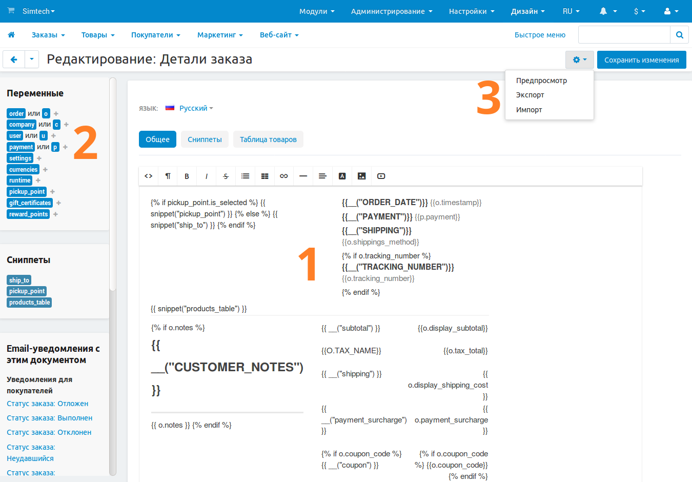

*********
Документы
*********

Начиная с версии 4.4.1, в CS-Cart и Multi-Vendor встроен редактор документов. Примерами таких документов могут служить счета, упаковочные листы и подарочные сертификаты. Редактор позволяет изменять документы в соответствии с вашими нуждами, экспортировать их, а также импортировать документы, созданные и экспортированные другими людьми.

Для доступа к редактору шаблонов перейдите в меню **Дизайн → Документы**.

.. note::

    После обновления до CS-Cart или Multi-Vendor версии 4.4.1 вам, возможно, понадобится :doc:`включить редактор самостоятельно <enable_document_editor>`.

.. contents::
   :backlinks: none
   :local:

=======================
Список типов документов
=======================

В редактор включён список типов документов, которые используются в магазине. Пожалуйста, обратите внимание, что модули сторонних разработчиков могут добавлять другие типы документов, которые могут как отображаться, так и не отображаться в списке.

.. note::

    Также на данной странице с помощью кнопки с изображением шестерёнки можно импортировать и экспортировать документы.

.. image:: img/document_types.png
    :align: center
    :alt: Список документов, доступных в магазине, по умолчанию.

На данный момент доступны следующие типы документов:

* Счёт заказа

* Детали заказа

* Упаковочный лист

* Подарочный сертификат

* Поставщики: счёт

* Возврат товаров: упаковочный лист

.. note::

    Пожалуйста, обратите внимание, что три типа из представленных становятся доступны только после установки и активации модулей **Подарочные сертификаты**, **Поставщики** и **Возврат товаров** соответственно.

==============================
Структура редактора документов
==============================

Щёлкните по названию нужного документа, чтобы открыть страницу с редактором. Ниже представлен краткий обзор структуры редактора.

-------------------
1. Основная область
-------------------

Основная область в центре страницы используется непосредственно для редактирования документов. По сути, документ представляет собой шаблон, который включает в себя переменные, языковые переменные, сниппеты и обычный текст. При создании документа из шаблона происходит замена переменных данными из магазина.

По умолчанию, включен визуальный редактор, упрощающий навигацию по шаблону. Кроме того, существует возможность просмотра и редактирования HTML-кода документа. Для этого на панели визуального редактора нажмите кнопку **<>** (**Source code**).

.. note::

    Вы можете выбрать тип визуального редактора или отключить его совсем. Для этого перейдите в меню **Настройки → Внешний вид** и измените настройку **“HTML-редактор по умолчанию”**. Это изменение затронет все страницы, где используется редактор.

Изменение переменных и сниппетов с помощью визуального редактора влияет на финальный вид документа. Например, если выделить переменную жирным шрифтом, значение переменной также будет отображаться жирным шрифтом.

Основная область содержит несколько вкладок:

* **Общее** — используется для предпросмотра и редактирования шаблона.

* **Сниппеты** — список сниппетов (готовых элементов шаблона), доступных для данного документа. На этой вкладке вы можете создавать новые сниппеты или редактировать уже существующие.

* **Таблица товаров** — список колонок таблицы товаров, встраиваемой в документ. Вы можете добавлять, редактировать, отключать и удалять колонки. Данная таблица добавляется в документ через сниппет ``products_table``.

* **Таблица товаров для возвратов** — список колонок таблицы товаров для возврата. Принцип её работы идентичен таблице товаров, но добавляется она в документ через сниппет ``returned_products_table``.

  .. note::

      Вкладка **“Таблица товаров для возвратов”** добавляется только к документам “Счёт” и “Детали заказа” и появляется только тогда, когда активирован модуль **Возврат товаров**.

------------------------
2. Переменные и сниппеты
------------------------

В левой части страницы располагается список переменных и сниппетов, которые можно использовать в шаблоне. Нажав на переменную или сниппет, вы автоматически добавите их в **Шаблон** документа. Точное положение зависит от того, где находится курсор на шаблоне.

* **Переменные** содержат различную информацию из базы данных, например, имена покупателей или идентификационные номера заказов.

  Также, в шаблонах документов можно использовать :ref:`языковые переменные <ru-language-variables>`. Например, если добавить в шаблон ``{{__("tracking_number")}}``, в готовый документ будет добавлен текст “Номер отслеживания”. Этот текст хранится в языковой переменной ``tracking_number``.

* **Сниппеты** представляют собой готовые элементы документов. Сниппеты используются, если нужно добавить сложную логику в шаблон, не перегружая при этом код шаблона в редакторе. У каждого документа свой собственный набор сниппетов.

  .. hint::

      Больше информации о сниппетах можно найти в :doc:`этой статье <document_snippets>`.

---------------------
3. Доступные действия
---------------------

С помощью **кнопки с изображением шестерёнки**, расположенной в правом верхнем углу, вы можете выполнять следующие действия:

* **Предпросмотр** — из шаблона создаётся тестовый документ, который затем отображается во всплывающем окне.

  .. important::

      Предпросмотр документов использует существующие в магазине данные. Например, для предпросмотра счёта, в магазине должен быть создан хотя бы один заказ. Для предпросмотра счёта определённого заказа воспользуйтесь инструкциями из :doc:`этой статьи <tweak_and_send_invoice>`. 

* **Экспорт** — экспорт выбранного документа с его сниппетами в файле формата XML.

* **Импорт** — импорт XML-файла с документами. Пожалуйста, обратите внимание, что в результате импорта некоторые документы могут быть перезаписаны, если файл импорта содержит шаблоны для данных документов.

* **Восстановить** — вернуть документ к изначальному состоянию в данной версии CS-Cart или Multi-Vendor. Эта кнопка появляется только после того, как вы изменили шаблон и сохранили свои изменения.

  .. warning::

      Нажав **Восстановить**, вы потеряете все изменения, которые были внесены в документ. Перед восстановлением рекомендуем вам сделать резервную копию документа через :doc:`экспорт <document_export_and_import>`.

================
В данном разделе
================

.. toctree::
    :maxdepth: 4
    :titlesonly:
    :glob:

    enable_document_editor
    document_export_and_import
    tweak_and_send_invoice
    document_snippets
