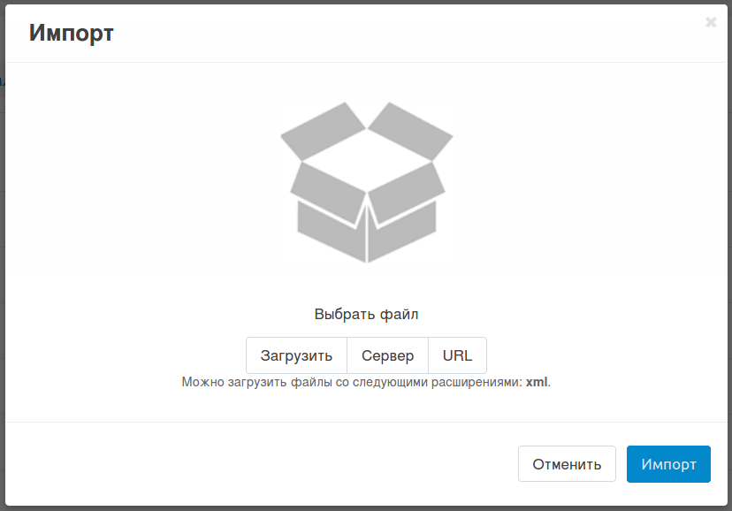

***********************************************************************
Как экспортировать и импортировать шаблоны email-уведомлений и сниппеты
***********************************************************************

.. contents::
   :backlinks: none
   :local:

.. image:: img/export_and_import_email_templates.png
    :align: center
    :alt: Для экспорта или импорта шаблонов уведомлений воспользуйтесь кнопкой с изображением шестерёнки, расположенной на странице со списком.

========================================
Экспорт шаблонов уведомлений и сниппетов
========================================

1. Откройте **Дизайн → Шаблоны email-уведомлений**.

2. Нажмите на **кнопку с изображением шестерёнки** в правом верхнем углу страницы.

3. Выберите **Экспорт**. Начнётся процесс загрузки файла в формате XML на ваш компьютер. В файле содержатся уведомления для администратора и покупателей, а также сниппеты.

=======================================
Импорт шаблонов уведомлений и сниппетов
=======================================

1. Откройте **Дизайн → Шаблоны email-уведомлений**.

2. Нажмите на **кнопку с изображением шестерёнки** в правом верхнем углу страницы.

3. Выберите **Импорт**.

4. В зависимости от расположения XML-файла, который вы хотите импортировать, нажмите на одну из трёх кнопок:

   * **Загрузить** — загрузка XML-файла непосредственно с компьютера пользователя.

   * **Сервер** — загрузка XML-файла с сервера, на котором установлен CS-Cart/Multi-Vendor.

   * **URL** — загрузка XML-файла по прямой ссылке на файл.

5. Нажмите **Импорт**. После этого шаблоны уведомлений и сниппеты будут импортированы в ваш магазин.

==========
Примечания
==========

* Все шаблоны и сниппеты экспортируются и импортируются вместе, в одном файле формата XML.

* Если при импорте коды (``<code>``) сниппетов совпадают, то существующий сниппет будет заменён импортируемым сниппетом с таким же кодом. То же самое касается и шаблонов email-уведомлений.

* Если в XML-файле изменить код (``<code>``) шаблона вручную, а затем импортировать данный файл, будет создан новый шаблон. Хотя новый шаблон и будет отображаться в списке на панели администратора, он не будет использоваться, если нет модуля, который отправляет уведомления с этим шаблоном.