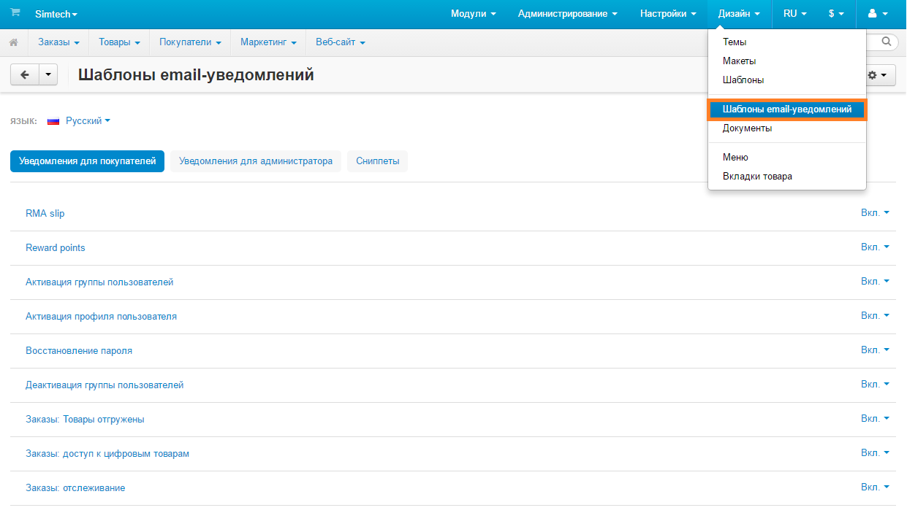
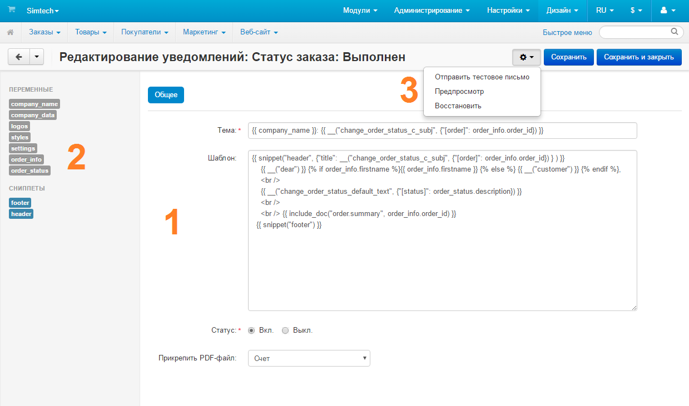

*************************
Шаблоны email-уведомлений
*************************

Начиная с версии 4.4.1, в CS-Cart и Multi-Vendor встроен редактор шаблонов email-уведомлений. Вы можете редактировать шаблоны в соответствии с вашими нуждами, экспортировать их, а также импортировать шаблоны, созданные и экспортированные другими людьми.

Редактор находится в меню **Дизайн → Шаблоны email-уведомлений**.

.. note::

    После обновления до CS-Cart или Multi-Vendor версии 4.4.1 вам, возможно, понадобится :doc:`включить редактор самостоятельно <enable_email_editor>`. 

.. contents::
   :backlinks: none
   :local:

==============================
Список типов email-уведомлений
==============================

В редактор включён список типов уведомлений, которые используются в магазине. Пожалуйста, обратите внимание, что модули сторонних разработчиков могут добавлять другие типы уведомлений, которые могут как отображаться, так и не отображаться в списке.

Для вашего удобства уведомления разбиты на две вкладки:

* Уведомления для покупателей.

* Уведомления для администратора.

На третьей вкладке находятся сниппеты — готовые элементы шаблонов, которые можно быстро добавить в  уведомления.

.. note::

    Также на данной странице с помощью **кнопки с изображением шестерёнки** можно :doc:`импортировать и экспортировать уведомления и сниппеты. <email_template_export_and_import>`

========================================
Структура редактора шаблонов уведомлений
========================================

Нажмите на название нужного уведомления, чтобы открыть страницу с редактором. Ниже представлен краткий обзор структуры редактора.

-------------------
1. Основная область
-------------------

Основная область в центре страницы используется непосредственно для редактирования уведомлений. Список атрибутов email-уведомления:

* **Тема** — шаблон темы письма.

* **Шаблон** — шаблон тела письма.

.. note::

    Данные шаблоны могут включать простой текст, переменные, языковые переменные, функции Twig, а также HTML и CSS-код. Текст email-уведомления формируется из **Темы** и **Шаблона** путём подстановки данных из магазина к переменным.

* **Статус** — определяет, будет ли отсылаться уведомление данного типа или нет.

* **Прикрепить PDF-файл** — позволяет прикрепить к уведомлению :doc:`документ определённого типа <../documents/index>` в формате PDF.

  .. note::

      PDF-файлы можно прикреплять только к email-уведомлениям, касающимся изменений статуса заказа. Названия данных уведомлений начинаются с **“Статус заказа:”**.

------------------------
2. Переменные и сниппеты
------------------------

В левой части страницы располагается список переменных и сниппетов, которые можно использовать в шаблоне. Нажав на переменную или сниппет, вы автоматически добавите их в **Тему** или в **Шаблон** уведомления. Точное положение зависит от того, где находится курсор на шаблоне.

* **Переменные** содержат различную информацию из базы данных, например, имена покупателей или идентификационные номера заказов.

  Также, в шаблонах уведомлений можно использовать :ref:`языковые переменные <ru-language-variables>`. Например, языковая переменная ``dear`` добавляет слово *“Уважаемый(-ая)”* (или его эквивалент в других языках) перед именем покупателя. Чтобы вставить эту языковую переменную в уведомление, , добавьте ``{{ __("dear") }}`` в подходящее место в шаблоне.

* **Сниппеты** представляют собой готовые элементы шаблонов, которые могут использоваться в различных уведомлениях. Также, убрав сложную логику в сниппеты, можно избавиться от отвлекающих элементов и упростить себе работу с редактором.

  .. hint::

      Больше информации о сниппетах можно найти в :doc:`этой статье. <email_snippets>`

---------------------
3. Доступные действия
---------------------

С помощью **кнопки с изображением шестерёнки**, расположенной в правом верхнем углу, вы можете выполнять следующие действия:

* **Отправить тестовое письмо** — из шаблона создаётся тестовое email-уведомление и отправляется на почтовый адрес администратора, выполнившего данное действие.

* **Предпросмотр** — из шаблона создаётся тестовое email-уведомление, которое затем отображается во всплывающем окне.

  .. important::

      Из-за отсутствия некоторых данных, примеры, созданные с помощью **тестового письма** и **предпросмотра**, могут отличаться от настоящих уведомлений, получаемых покупателями и администраторами.

* **Восстановить** — вернуть **Тему** и **Шаблон** уведомления к изначальному состоянию в данной версии CS-Cart или Multi-Vendor. Эта кнопка появляется только после того, как вы изменили шаблон и сохранили свои изменения.

  .. warning::

      Нажав **Восстановить**, вы потеряете все изменения, которые были внесены в данное уведомление. Перед восстановлением рекомендуем вам сделать резервную копию уведомления через :doc:`экспорт. <email_template_export_and_import>`

================
В данном разделе
================

.. toctree::
    :maxdepth: 4
    :titlesonly:
    :glob:

    enable_email_editor
    email_template_export_and_import
    email_snippets
