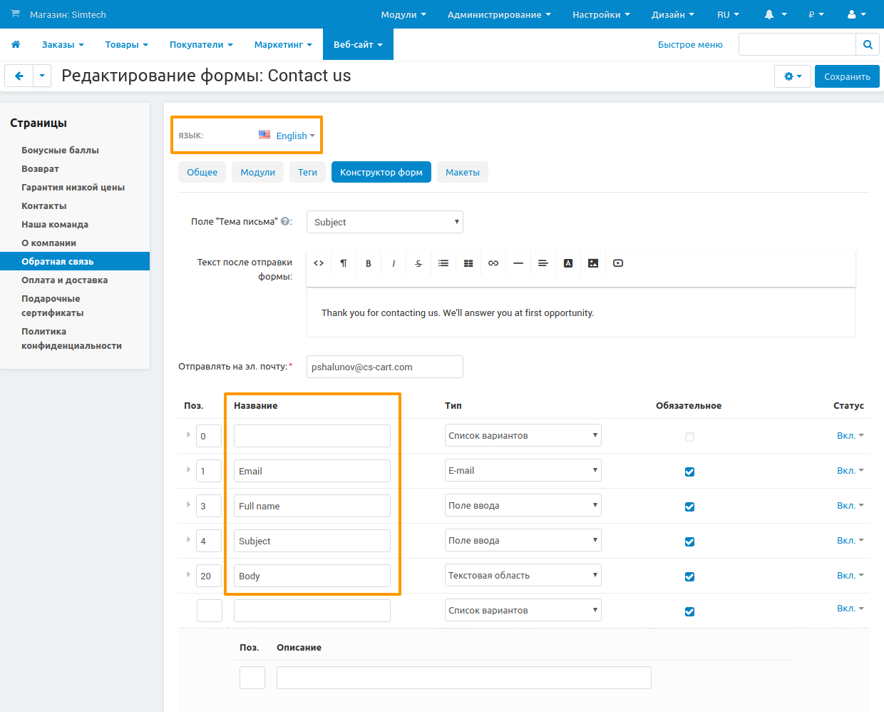

**********************************
Перевод полей формы обратной связи
**********************************

Для перевода полей на странице формы **обратной связи** требуется выполнить следующие шаги:

1. В панели администратора открыть **Веб-сайт → Страницы**.

2. Перейти на страницу **Обратная связь** и открыть вкладку **Конструктор форм**.

3. Выбрать нужный язык в поле выбора **Язык**.

4. В поле **Название** заменить имеющиеся значения на переведенные.

5. Сохранить изменения, нажав кнопку **Сохранить**

