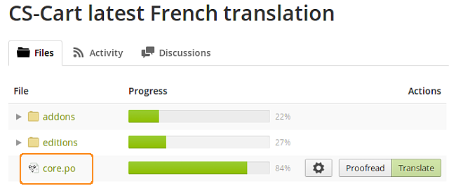
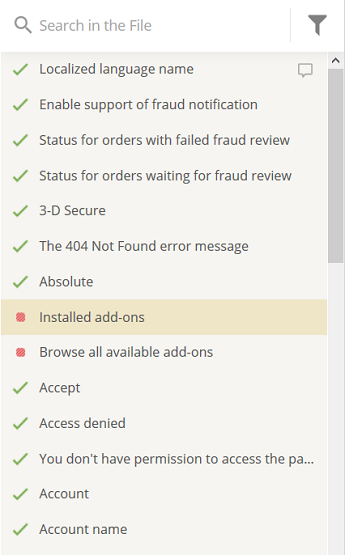

****************************************************
Совместный перевод CS-Cart с помощью сервиса Crowdin
****************************************************

**Crowdin** — это веб-сервис для совместного перевода, который позволяет каждому члену сообщества внести свой вклад в перевод CS-Cart и Multi-Vendor на разные языки.

Для того, чтобы поучаствовать в переводе через Crowdin, выполните следующие шаги:

1. Перед тем, как приступить к переводу, рекомендуется `прочесть FAQ по Crowdin на нашем форуме <http://forum.cs-cart.com/topic/36338-translation-faq/>`_.

2. Откройте `наш проект на Crowdin <https://crowdin.com/project/cs-cart-latest>`_.  

3. Зарегистрируйтесь на Crowdin. 

4. Из списка **Needs Translation** выберите перевод, в котором вы бы хотели поучаствовать, например, **French**.

.. note::

    Если вы уверены в своем знании языков, можно поучаствовать в нескольких переводах сразу.

.. image:: img/language_list.png
    :align: center
    :alt: Выберите язык, на который вы бы хотели перевести CS-Cart.

5. После этого откроется новая страница. Как вы могли заметить, перевод разделён на несколько частей: **addons**, **editions** и **core**.

6. Щёлкните по названию файла, чтобы приступить к переводу. Например, выберите **core.po**.

7. Откроется новая страница. На этой странице и происходит сам процесс перевода. В левой колонке щёлкните по языковой переменной, которую хотите перевести.

.. note::

    **Зеленая галочка** напротив языковой переменной означает, что данная переменная была переведена и одобрена. **Зеленая точка** означает, что переменная была переведена, но ещё не одобрена. **Красная точка** означает, что переменная ещё не переведена.

.. note::

    Для фильтрации языковых переменных щёлкните по **кнопке воронки**. Например, фильтры можно использовать для отображения только непереведенных переменных или тех, которые были одобрены.

8. В центральной части страницы в поле **Text for translation** располагается непосредственно сама переменная. Введите свой перевод в поле под ней и нажмите кнопку **Save**. После этого, вы увидите ваш перевод в поле **Suggestions**.

.. note:: 

    Проверяющие выбирают наиболее точный перевод из предложенных переводчиками вариантов. Перевод, одобренный проверяющим, отмечается зеленой галочкой, также как время и дата проверки.

9. Вы можете оставить свои комментарии и обсудить переводы с другими переводчиками и проверяющими в правой части страницы.

.. image:: img/crowdin_discuss.png
    :align: center
    :alt: Crowdin позволяет обсуждать переводы.

