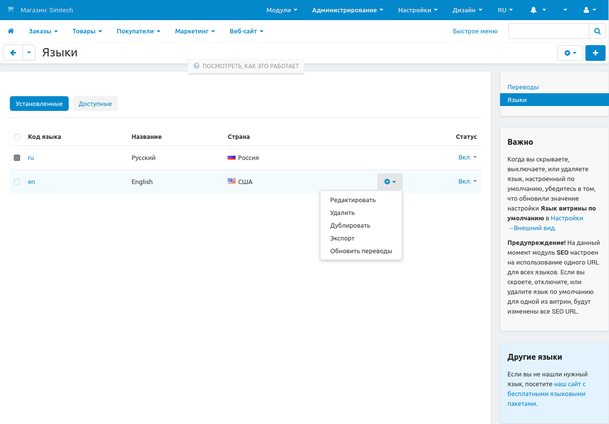
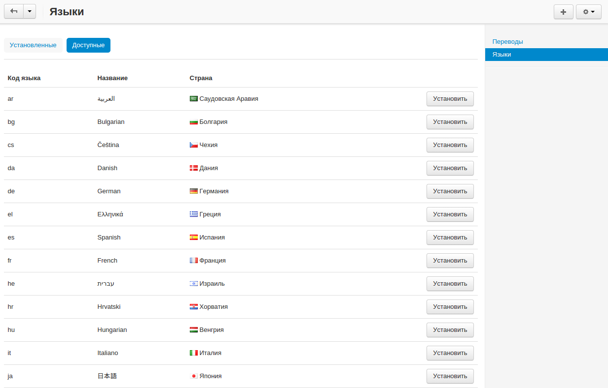
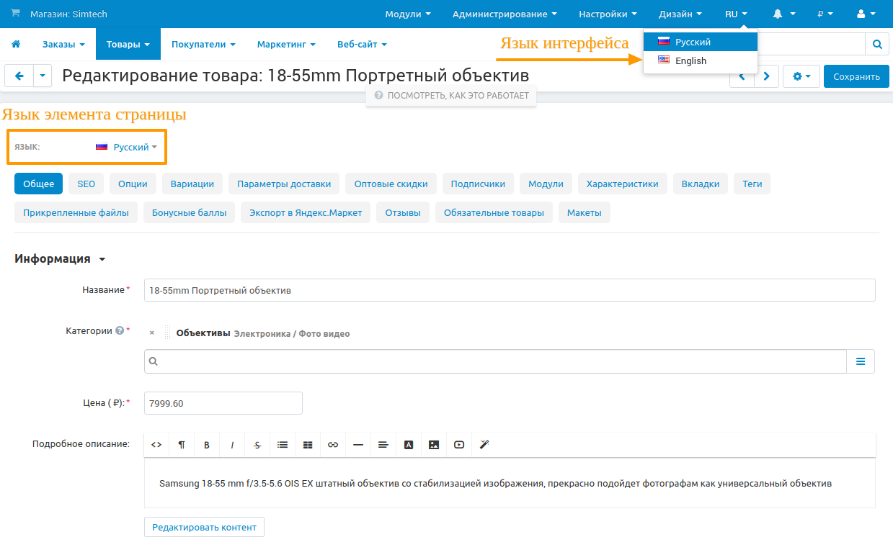

*****
Языки
*****

==================
Управление языками
==================

Вы можете управлять языками доступными в вашем магазине из **Администрирование → Языки → Языки**. На данной странице представлены две вкладки:

* **Установленные** — языки, установленные в вашем магазине.

* **Доступные** — языки, которые можно установить.

Значок **шестеренки** на панели языка позволяет редактировать, дублировать или экспортировать язык, а также обновлять для него переводы.

===============
Установка языка
===============

1. В панели администратора откройте **Администрирование → Языки → Языки**.

2. Переключитесь на вкладку **Доступные**.

3. Выберите нужный язык и щёлкните по кнопке **Установить** рядом с ним.

===============================
Язык интерфейса и язык контента
===============================

Языки интерфейса панели администратора и язык редактируемого контента могут отличаться. Это полезно, если вы продаете товары за рубежом и хотите обновить описания товаров или названия категорий, не переключаясь при этом полностью на нужный язык.

* Для изменения языка интерфейса панели администратора:

  1. В самом верхнем меню в правом углу найдите пункт с кодом языка.

  2. Нажмите на код и выберите нужный язык из выпадающего меню.

* Для изменения языка редактируемого контента:

  1. В панели администратора откройте страницу редактирования нужного объекта (например, категории, товара и т.п.).

  2. В левом верхнем углу на странице редактирования выберите нужный язык из выпадающего списка  **Язык**.

==============
В этом разделе
==============

.. toctree::
    :maxdepth: 4
    :titlesonly:
    :glob:

    contact_us_form
    translate

.. toctree::
    :maxdepth: 4
    :hidden:
    :glob:

    crowdin
