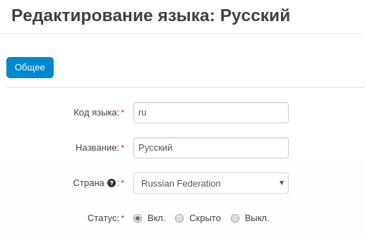

************************
Способы перевода CS-Cart
************************

.. important::

    Прежде, чем добавить новый язык, убедитесь, что данного языка нет на сайте `translate.cs-cart.com <http://translate.cs-cart.com/>`_. 

============================
Скачать существующий перевод
============================

Чтобы добавить новый язык с сайта *translate.cs-cart.com* в ваш CS-Cart, выполните следующие шаги:

1. Откройте `translate.cs-cart.com <http://translate.cs-cart.com/>`_, найдите необходимый вам язык и щелкните по его названию.

2. Сохраните файл.

3. В вашем магазине откройте панель администратора.

4. Откройте **Администрирование → Языки → Языки**.

5. Чтобы добавить язык, в правом верхнем углу нажмите кнопку **+**.

6. Откроется новая страница. С помощью данной страницы загрузите файл в формате **PO**, который вы перед этим скачали с сайта *translate.cs-cart.com*.

7. Нажмите кнопку **Установить**. Новый язык появится в списке установленных языков.

=====================
Создать новый перевод
=====================

.. note::

    Прежде, чем добавить новый перевод, убедитесь, что нужный вам язык отсутствует в списке языков на вкладке "Доступные", расположенной в **Администрирование → Языки → Языки**. Также убедитесь в том, что данный язык отсутствует на сайте `translate.cs-cart.com <http://translate.cs-cart.com/>`_. 

1. Откройте **Администрирование → Языки → Языки**.

2. Щелкните по кнопке **шестеренки**, расположенной рядом с одним из языков, и выберите **Дублировать**.

3. Во всплывающем окне введите состоящий из двух букв языковой код. Новый язык будет добавлен в список **установленных** языков (новый язык является копией существующего языка). На витрине и в панели администратора появится поле выбора, позволяющее пользователям выбирать язык.

4. Щелкните по кнопке **шестеренки**, расположенной рядом с новым языком и в выпадающем меню, выберите **Редактировать**

5. Заполните поля и щелкните **Сохранить**.

.. _ru-language-variables:

===========================
Перевести CS-Cart "вручную"
===========================

Большинство текстов CS-Cart хранятся в виде, так называемых, языковых переменных. И хотя в CS-Cart есть возможность перевода переменных вручную на странице **Переводы**, расположенную в **Администрирование → Языки → Переводы**, мы рекомендуем иной путь:

1. Откройте панель администратора и пройдите на страницу **Переводы**, расположенную в **Администрирование → Языки → Переводы**.

2. Нажмите кнопку **шестеренки** в правом верхнем углу страницы, из выпадающего меню выберите **Редактирование содержимого**.

3. Вы будете перенаправлены на витрину, где сможете переводить тексты, обведённые пунктирной линией. Для этого выполните следующие шаги:

 * Выберите новый язык из списка в левом верхнем углу страницы.

 * Наведите курсор мыши на текст, обведённый пунктирной линией. Над текстом появится иконка **редактировать**, которую необходимо кликнуть.

 * Введите текст перевода в выбранное поле.

 * Щёлкните по **зелёной галочке** для сохранения изменений.

4. После того, как вы закончите переводить весь видимый текст, некоторые переменные всё же останутся непереведёнными, в частности, переменные, отображаемые в почтовых уведомлениях и некоторых особых случаях, например, уведомления об ошибке, сообщения во всплывающих окнах и т.д. Для перевода оставшихся переменных необходимо выполнить следующие шаги:

 * Откройте **Администрирование → Языки → Переводы**.

 * Выберите новый язык в поле выбора в левом верхнем углу.

 * Теперь вы можете редактировать текстовые переменные выбранного языка.

 * Перевести тексты в поле ввода **Значение** языковой переменной.

.. important::

    Будьте осторожны — если в поле выбора языка стоит *Русский*, вы будете редактировать русские тексты.

.. image:: img/translations.png
    :align: center
    :alt: You can translate CS-Cart from the administration panel.

.. important::

    **Не переводите и не удаляйте слова в квадратных скобках, написанные строчными буквами**, например, ``[link]``, ``[product]``, и т.д. Это переменные значение которых подставляется автоматически при переносе их на витрину. Например, ``[product]`` заменяется соответствующим наименованием товара. 

.. important::

    **Слова, написанные в квадратных скобках, но заглавными буквами, необходимо переводить**. Например, ``[ALREADY PATCHED]``, ``[DELETED]``, ``[FAILED]``, ``[NON WRITABLE]``, и т.д. Это уведомления, создаваемые **Центром обновлений**, и они подлежат переводу.

 * Нажмите кнопку **Сохранить**, чтобы сохранить изменения, внесённые в языковые переменные на этой странице.

.. important::

    **Сохраняйте ваши изменения на каждой странице**, где вы переводите языковые переменные. Если вы откроете следующую страницу с переменными, предварительно не сохранив изменения на текущей, все ваши изменения будут потеряны.

5. Не забудьте перевести содержимое нижеприведённых страниц в панели администратора, так как они также связаны с витриной:

* **Администрирование → Статусы → Статусы заказов**

* **Маркетинг → Подарочные сертификаты → Статусы сертификатов**

* **Администрирование → Поля профиля**

* **Покупатели → Группы пользователей**

* **Администрирование → Доставка и налоги → Способы доставки**

* **Администрирование → Доставка и налоги → Страны**

* **Администрирование → Доставка и налоги → Регионы** (если необходимо)

* **Администрирование → Способы оплаты**

* **Администрирование → Валюты**

* **Дизайн → Макеты**

* **Веб-сайт → Страницы → Формы** (страница обратной связи)

* **Товары → Товары**

* **Товары →  Категории**

* **Товары → Характеристики**

* **Товары → Фильтры**

* **Товары → Опции**

6. Также, в случае, если вы включили соответствующие модули, вам, возможно, потребуется перевести следующие страницы:

* **Маркетинг → Подарочные сертификаты**

* **Заказы → Запросы на возврат → Статусы запросов на возврат** (данную страницу следует переводить, если вы планируете пользоваться модулем **Возврат товаров**)

* **Маркетинг → Баннеры**

* **Веб-сайт → Блог**

Для перевода перечисленных выше страниц, необходимо выполнить следующие шаги:

* Откройте нужную страницу и выберите язык в языковой секции в верхнем левом углу страницы.

* Откройте страницу редактирования элемента (например, **статус заказа**), введите необходимую информацию для выбранного языка в новом окне, затем нажмите кнопку **Сохранить**

* Повторите предыдущий шаг для других элементов на странице.

.. important::

    Мы рекомендуем закрыть витрину (**Настройки → Общие**), когда включен режим **редактирования содержимого**. Данный режим отображает информацию о дебаггинге, которая может запутать покупателей.

Также вы можете `принять участие в совместном переводе CS-Cart с помощью платформы Crowdin <https://crowdin.com/projects/cscart>`_.

