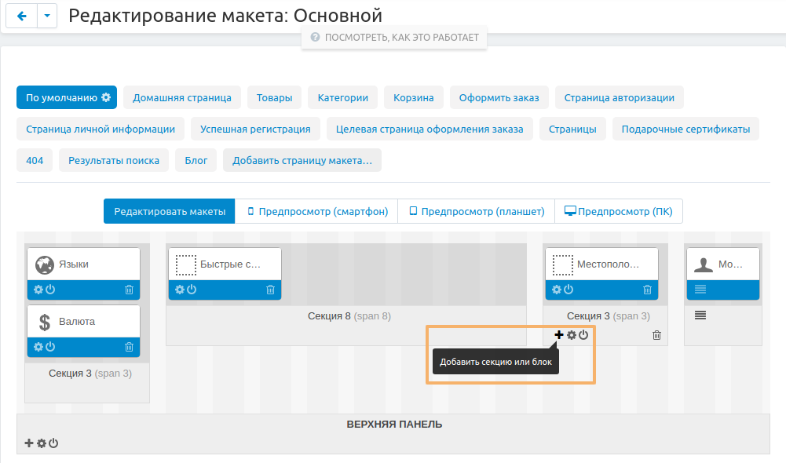
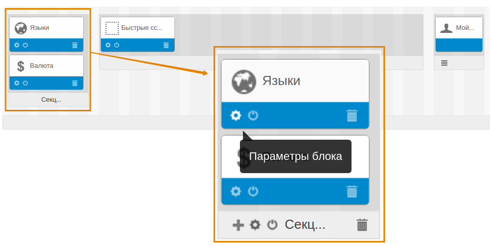
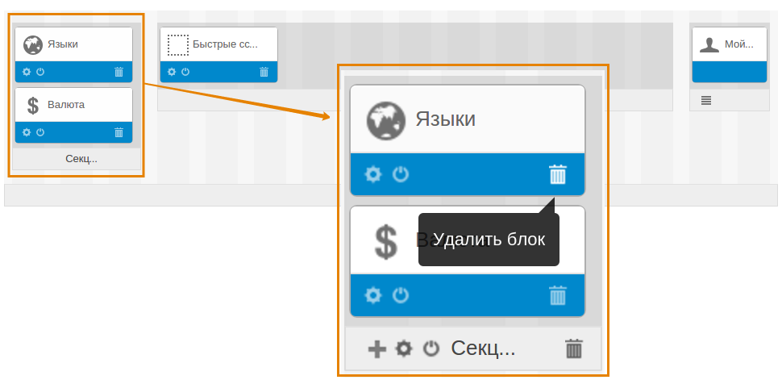
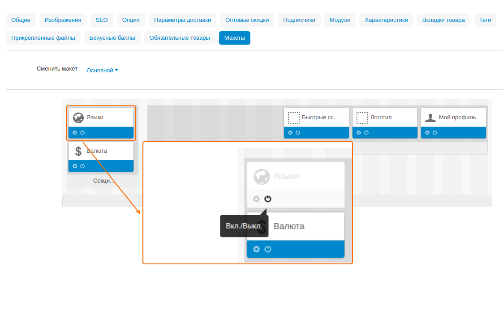

****************
Работа с блоками
****************

В CS-Cart вы можете менять расположение блоков на странице, добавлять и удалять их, изменять свойства блоков, включать и выключать их, а также подгонять блоки под индивидуальные конфигурации страниц.

Для работы с блоками вам необходимо перейти на страницу **Дизайн → Макеты** и выбрать макет страницы, где требуется внести изменения.

.. note::

    Для блоков, используемых в контейнерах, расположенных в "Верхней панели", "Заголовке" или "Подвале", необходимо использовать `макет "По умолчанию" <http://docs.cs-cart.com/4.3.x/user_guide/look_and_feel/layouts/layout_pages/index.html>`_.

======================================
Изменение положения блоков на странице
======================================

Для изменения положения блока просто перетащите его на нужное место.

.. note::

    Все блоки располагаются в `дочерних контейнерах <http://docs.cs-cart.com/4.3.x/user_guide/look_and_feel/layouts/framework/index.html>`_.

=================
Добавление блоков
=================

При добавлении блока на выбор доступны две опции:

* Использовать существующий блок.

* Создать новый блок.

----------------------------------
Использование существующего блока:
----------------------------------

1. Нажмите кнопку **+** на контейнере, в котором должен располагаться новый блок и выберите **Добавить блок**.

2. Выберите вкладку **Использовать существующий блок**.

3. Выберите блок из списка и щёлкните по его иконке.

Блок появится рядом с другими блоками в контейнере.

----------------------
Создание нового блока:
----------------------

1. Нажмите кнопку **+** на контейнере, в котором должен располагаться новый блок и выберите **Добавить блок**.

2. Выберите вкладку **Создать новый блок**.

3. Выберите тип блока и щёлкните по его иконке. Откроется окно настройки нового блока.

4. Настройте параметры.

5. Щёлкните **Создать**.

Блок появится рядом с другими блоками в контейнере. Также, блок будет добавлен в список существующих блоков

.. note::

    Типы блоков и их свойства описаны в :doc:`этой статье <../blocks/block_types_properties>`. 

=====================
Редактирование блоков
=====================

1. Наведите курсор на нужный блок и щёлкните по иконке **шестерёнки**. Откроется окно настройки блока.

2. Отредактируйте параметры блока.

3. Щёлкните **Сохранить**, чтобы изменения вступили в силу.

.. note::

    Типы блоков и их свойства описаны в :doc:`этой статье <../blocks/block_types_properties>`. 

===============
Удаление блоков
===============

1. Наведите курсор на нужный блок и щёлкните по иконке **Мусорной корзины**.

2. Во всплывавющем окне подтвердите действие.

Также для создания и редактирования блоков можно щёлкнуть по кнопке **шестерёнки** в правом верхнем углу и в выпадающем меню выбрать вкладку **Блоки**.

===========================================
Использование блоков на отдельных страницах
===========================================

По умолчанию блоки прикрепляются ко всем страницам, использующим определённый макет, например, страница категории на витрине.

Однако, существует возможность выключать блоки для отдельных элементов витрины (определённые товары, категории, страницы с содержимым и т.д.). Также существует возможность включить блок только на одной определённой странице и при этом выключить его в настройках макета.

Чтобы включить/выключить блок на странице определённого элемента:

1. В панели администратора откройте детальную страницу элемента.

2. Переключитесь на вкладку **Макеты**

3. Включите или выключите нужный блок.

