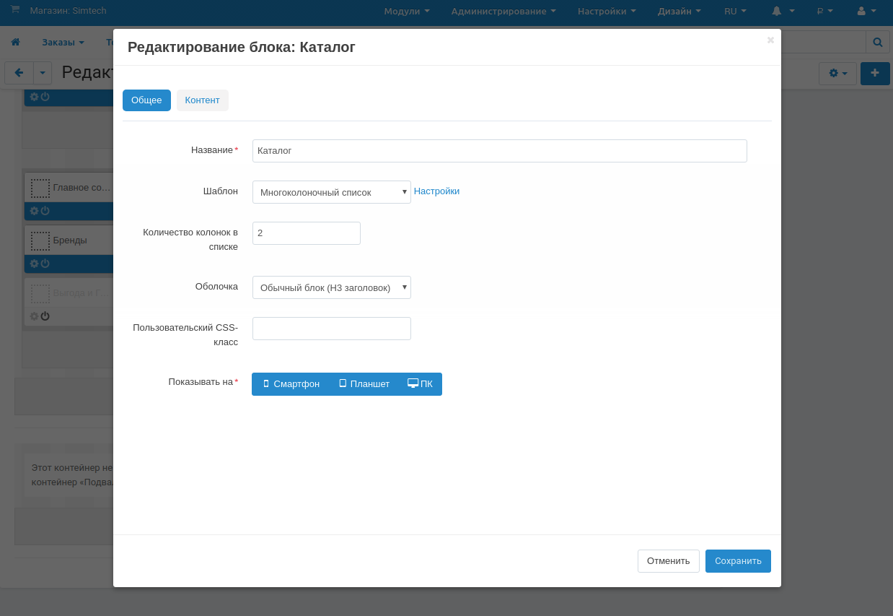
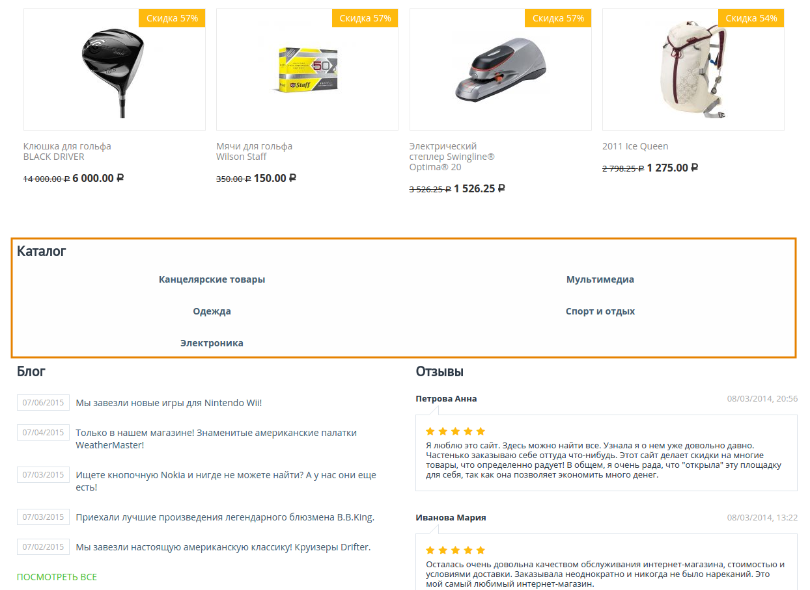

*****************************************************
Как настроить категории на гдомашней странице витрины
*****************************************************

С помощью блока **Категории** вы можете создать и вывести на домашнюю страницу витрины список нужных вам категорий.

1. В панели администратора откройте **Дизайн → Макеты → вкладка "Домашняя страница"**.

2. Нажмите кнопку **+** на контейнере, в котором должен располагаться новый блок и выберите **Добавить блок**.

3. Переключитесь на вкладку **Создать новый блок** и выберите тип блока **Категории**.

4. В открывшемся окне укажите название нового блока (например, *Каталог*) и щёлкните по кнопке **Создать**.

5. На созданном блоке щёлкните по кнопке **шестерёнки** и в открывшемся окне выберите:

    * *Многоколоночный список* в поле **Шаблон**.
    * *Обычный основной контейнер* в поле **Оболочка**.

6. Щёлкните по кнопке **Настройке** рядом с полем **Шаблон** и введите требуемое число колонок в поле **Количество колонок в списке**.

7. Также в поле **Пользовательский CSS-класс** можно указать подходящий CSS-класс.

8. Переключитесь на вкладку **Страницы** и в поле **Заполнение** выберите *Вручную*. Щёлкните **Добавить категории**, добавьте категории и щёлкните **Добавить категории и закрыть**.

9. Нажмите **Сохранить**.

.. image:: img/arranging_categories_02.png
    :align: center
    :alt: Вкладка Страницы

.. note::

    После создания или изменения блока убедитесь в том, что он отображается корректно. В некоторых случаях, оболочка может быть несовместима с блоком определённого типа.

Таким образом категории представлены на домашней странице витрины:

