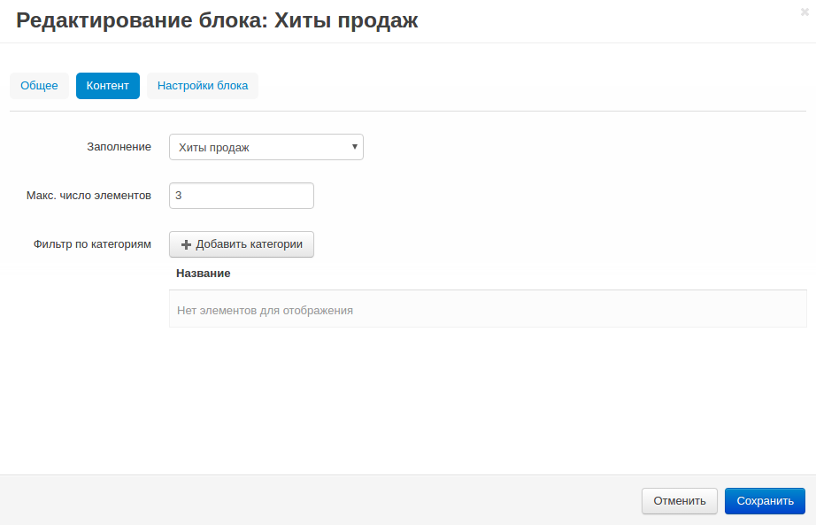
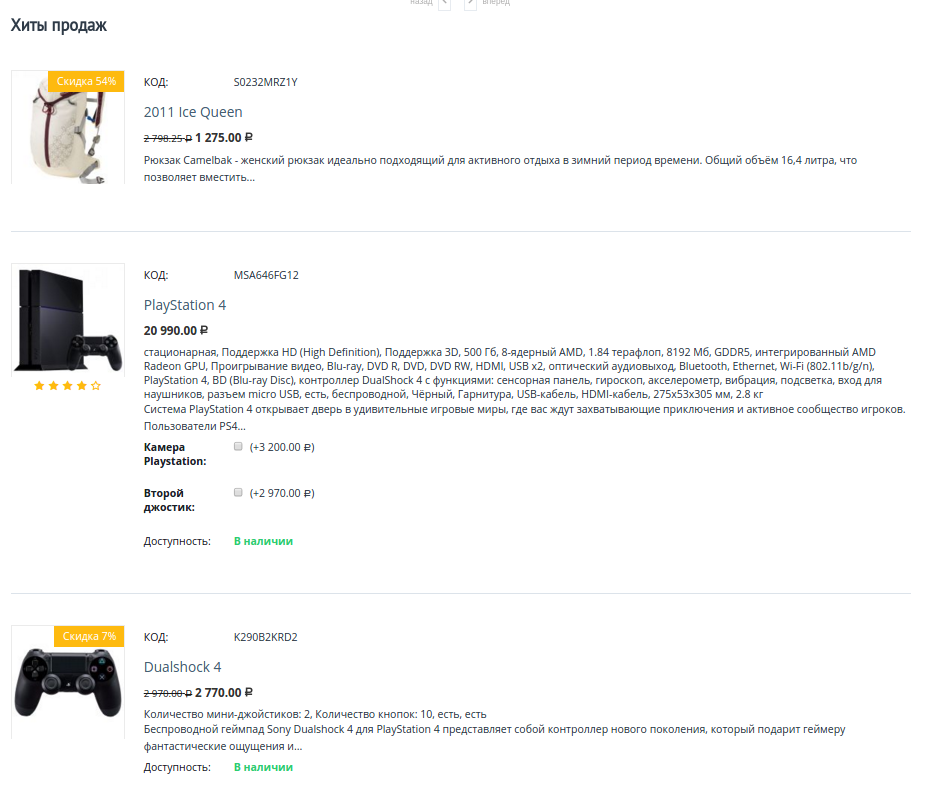

****************************************************
Как добавить блок "Хиты продаж" на домашнюю страницу
****************************************************

В разделе "Хиты продаж" показаны самые популярные товары в магазине. Данный раздел помогает увеличить продажи и привлечь новых покупателей.

1. В панели администратора откройте страницу **Модули → Управление модулями**.

2. Включите модуль **Хиты продаж и товары со скидкой**.

3. Перейдите в **Дизайн → Макеты → вкладка "Домашняя страница"**.

4. Нажмите кнопку **+** на контейнере, в котором должен располагаться новый блок, и выберите **Добавить блок**.

5. Переключитесь на вкладку **Создать новый блок** и выберите тип блока **Товары**. В открывшемся окне:

    * Введите название блока (например, *Хиты продаж*).
    * Выберите *Товары* в поле **Шаблон**.

	.. image:: img/add_block.png
	   	:align: center
	   	:alt: Добавить блок

    * Переключитесь на вкладку **Страницы** и выберите *Хиты продаж* в поле **Заполнение**.
    * Нажмите **Создать**.

6. Чтобы изменить местоположение блока просто перетащите его в нужное вам место.

Вот так блок "Хиты продаж" выглядит на домашней странице:

