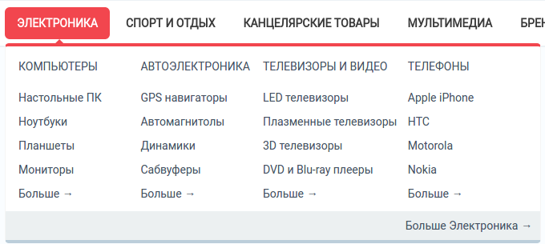
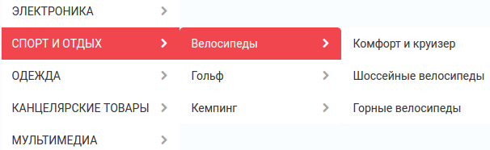
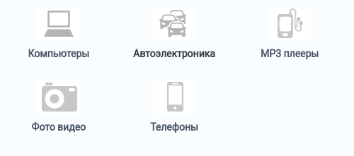
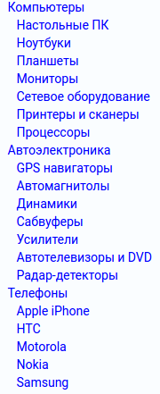

***************
Block Templates
***************

.. warning::

    Эта страница уже неактуальна. Пожалуйста, :doc:`вернитесь на главную страницу раздела. <index>`

The following templates are used in blocks.

.. _auth_information:

Authentication information
**************************

Standard use authentication form.

.. _blog_recent_posts:

Blog: recent posts
******************

Posts appear as a list of links.

.. _blog_recent_scroller:

Blog: recent posts scroller
***************************

Scrolled list of blog posts.

.. _blog_text_links:

Blog: text links
****************

A simple list of text links with the dates of publishing.

.. _breadcrumbs:

Breadcrumbs
***********

Standard breadcrumbs navigation aid.

.. _carousel:

Carousel
********

Items appear in a carousel-like manner: a horizontally scrollable list with pagination where only one item at a time is displayed.

This template has the following settings:

*	**Navigation** - Type of the item switcher in the list: dots, digits, or arrows. You can also disable manual switching between the items by selecting *None*. In this case, items will be switching automatically.
*	**Delay (in seconds)** - Number of second to pass before items switch over.

.. _cart_content:

Cart content
************

Standard mini-cart to be placed on the storefront pages.

.. _central:

Central
*******

Layout intended for the content appearing in the center of the page.

.. _copyright:

Copyright information
*********************

Copyright information that you have specified in **Settings → Company**.

.. _currencies:

Currencies
**********

A list of supported currencies defined in **Administration → Currencies**. Appearance options should be configured in the block settings.

.. _dropdown_horizontal:

Dropdown horizontal
*******************

List of categories with drop-down lists that are displayed top-to-bottom. For hierarchical list, the following menu options are supported:

*	**Second level elements** - Maximum number of second-level elements within a menu item.
*	**Third level elements** - Maximum number of third-level elements within a second-level menu item.

.. _dropdown_vertical:

Dropdown vertical
*****************

List of categories with drop-down lists that are displayed vertically left-to-right. To display lists right-to-left choose **Right to left orientation** checkbox.

.. _feature_comparison:

Feature comparison
******************

List of products selected for comparison.

.. _gift_certificate:

Gift certificate
****************

Form to apply a gift certificate to the order.

.. _gs_verification:

Gift certificate verification
*****************************

Field to enter the number of a gift certificate.

.. _grid:

Grid
****

Items (item thumbnail next to a text link) arranged in a grid.

.. _grid_2:

Grid 2
******

Items (item thumbnail above a text link) arranged in a grid.

.. _html_block:

HTML block
**********

Custom HTML content.

.. _html_block_smarty:

HTML block with Smarty support
******************************

Custom HTML/Smarty content.

.. _icon:

Icon
****

Regular RSS feed icon to the store RSS feed.

.. _languages:

Languages
*********

List of storefront languages defined in **Administration → Languages**.

.. _links_thumb:

Links thumb
***********

Product thumbnail with a text link to the product page.

.. _multicolumn_list:

Multi-column list
*****************

List of items arranged in multiple columns. Number of columns is defined through the template option **Number of columns in the objects list**.

.. _multicolumns_small:

Multicolumns small
******************

List of small items arranged in multiple columns.

.. _my_account:

My account
**********

Links to the account details of the logged in customer.

.. _my_account_links:

My account links
****************

Links to the account pages of the customer who has logged in.

.. _newsletter_subscription:

Newsletter subscription form
****************************

Form to subscribe to newsletters.

.. _order_information:

Order information
*****************

Order details on the checkout page.

.. _original:

Original
********

Box with all available product filters and a price slider.

.. _our_brands:

Our Brands
**********

A list of product brands that are defined as features with the **Brand/Manufacturer** type.

.. _payment_systems_icons:

Payment systems icons
*********************

Icons of the supported payment systems in the store.

.. _payments:

Payments
********

Icons of all the available payment methods in the store.

.. _products:

Products
********

Products are displayed in the box just the same as they are displayed in a typical product list.

.. _products_in_cart:

Products in cart
****************

Cart contents displayed during the checkout process.

.. _products_2:

Products2
*********

Products are displayed with thumbnails and price, and are arranged in multiple columns.

.. _products_grid:

Products grid
*************

Products are displayed with big thumbnails and price, and are ordered by grid.

.. _profile_info:

Profile information
*******************

Profile details of a customer who has logged in. These include login credentials and personal data.

.. _quick_links:

Quick links
***********

Active quick links defined in **Design → Menus**.

.. _scroller:

Scroller
********

Scrolled list of products.

.. _search_field:

Search field
************

Regular search form.

.. _shipping_estimation:

Shipping estimation
*******************

Box with estimated shipping rates.

.. _shippings:

Shippings
*********

Icons of all the available shipping methods in the store.

.. _short_list:

Short list
**********

Products are displayed with small thumbnails, and are arranged in a table.

.. _side_box:

Side box
********

Template for a poll or questionnaire that is placed inside a side box.

.. _side_box_first_item:

Side box first item
*******************

The first product is displayed with a thumbnail and a text link, and the rest of the products are represented as a link to the products page.

.. _site_news:

Site News
*********

A list of links to recently added news according to the date.

.. _small_items:

Small items
***********

Product thumbnail with a text link to the product page.

.. _store_locator:

Store locator
*************

Location of your store on Google's map as specified in **Add-ons → Store locator**.

.. _store_logo:

Store logo
**********

Storefront logo as specified in the **Visual Editor** in **Design → Themes**.

.. _summary:

Summary
*******

Template to display the order summary on the checkout page.

.. _tag_cloud:

Tag cloud
*********

List of tags that the store administrator created in **Website → Tags**.

.. _testimonials:

Testimonials
************

List of testimonials submitted by the customers. To manage testimonials, use the **Website → Testimonials** section.

.. _text_links:

Text links
**********

A simple list of text links.

.. _404_error:

The 404 Not Found Error Message
*******************************

Textual notification for users that the requested page cannot be found.

.. _vendors:

Vendors
*******

List of active vendors accounts in the store.

.. note ::

	This template is available only for Multi-Vendor.

.. _without_image:

Without image
*************

Simple text link together with the product price.
