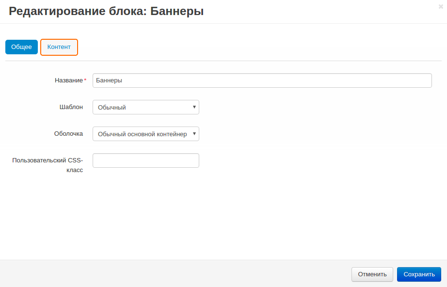
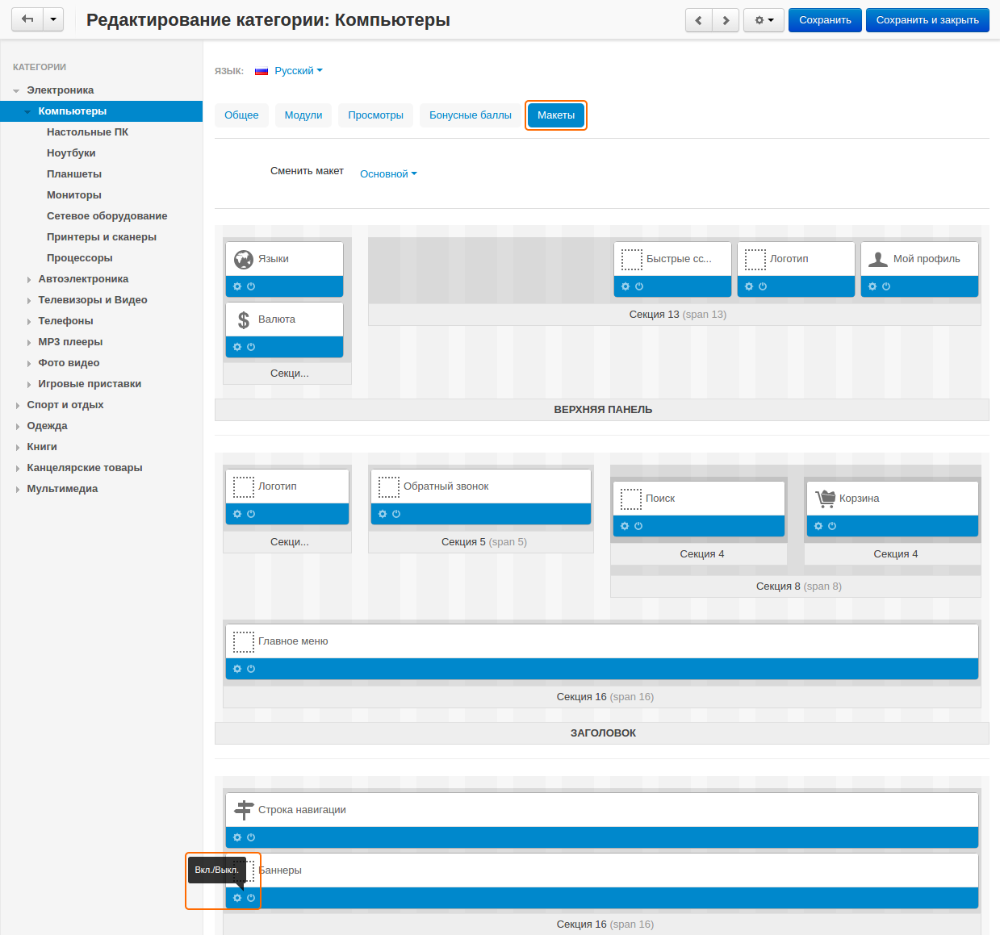

***********************************************************
Как показывать разные баннеры на разных страницах категорий
***********************************************************

======================
Шаг 1. Создать баннеры
======================

1. В панели администратора откройте **Маркетинг → Баннеры**.

2. Щёлкните по кнопке **+** в правом верхнем углу и на открывшейся странице:

   * Введите **Название** баннера (например, *Новый баннер*).

   * В поле **Тип** выберите *Графический баннер*.

   * Загрузите изображение для баннера.

   * Поставьте галочку в поле **Открывать ссылку в новом окне**, если вы хотите, чтобы прикреплённая ссылка открывалась в новом окне/вкладке (Доступно только для графических баннеров).
   
   * В поле **URL** укажите ссылку на страницу, которая будет открываться при щелчке по баннеру.

3. Щёлкните **Сохранить и закрыть**.

4. Повторите указанные шаги для создания баннеров для разных категорий.

================================
Шаг 2. Создать блок для баннеров
================================

1. В панели администратора откройте **Дизайн → Макеты** и переключитесь на вкладку **Категории**.

2. Нажмите кнопку **+** на контейнере, в котором должен располагаться новый блок и выберите **Добавить блок**.

3. Переключитесь на вкладку **Создать новый блок** и выберите тип блока **Баннеры**. В открывшемся окне:

   * Введите **Название** блока (например, *Баннеры*).
   * В поле **Шаблон** выберите *Обычный*.
   * Нажмите **Создать**.

4. Щёлкните по значку **шестерёнки** на блоке и выберите:

   * Оболочку в поле **Шаблон**.
   * CSS-класс в поле **Пользовательский CSS-класс**, если необходимо.

5. Переключитесь на вкладку **Контент** и в поле заполнение выберите *Вручную*.

6. Щёлкните **Сохранить**.

=============================================
Шаг 3. Добавить баннеры на страницы категорий
=============================================

1. В панели администратора откройте **Товары → Категории** и выберите нужную категорию.

2. На странице редактирования категории откройте вкладку **Макеты**.

3. Убедитесь в том, что блок **Баннеры** включен.

4. Щёлкните по значку **шестерёнки** на "баннерах" и переключитесь на вкладку **Контент**.

5. Нажмите кнопку **Добавить баннеры**, выберите подходящие баннеры и щёлкните **Добавить баннеры и закрыть**.

6. Щёлкните **Сохранить**.

7. Повторите указанные шаги для других категорий.

.. note::

    После внесения изменений убедитесь, что блок отображается корректно. В некоторых случаях выбранные оболочки не подходят для определённых типов блоков.
