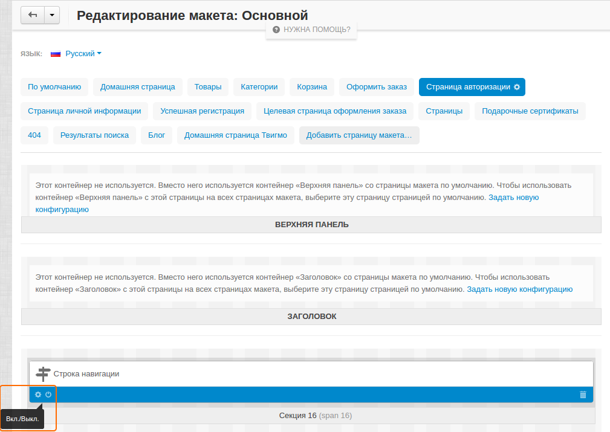

*******************************************************************
Как скрыть блок строки навигации на страницах авторизации и профиля
*******************************************************************

Для выключения строки навигации выполните следующие шаги:

1. В панели администратора откройте страницу **Дизайн → Макеты**.

2. В зависимости от того, где вы хотите выключить блок, выберите вкладку **Страница авторизации** или же **Страница личной информации**.

3. Нажмите кнопку **Вкл./Выкл.** на блоке **Строка навигации**.

Когда блок посереет, это означает, что он выключен.

.. note::

    Подобным образом вы можете скрывать и другие блоки.
